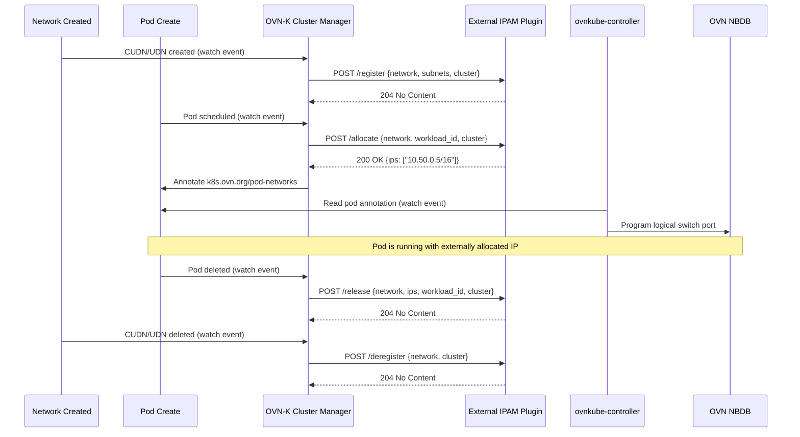
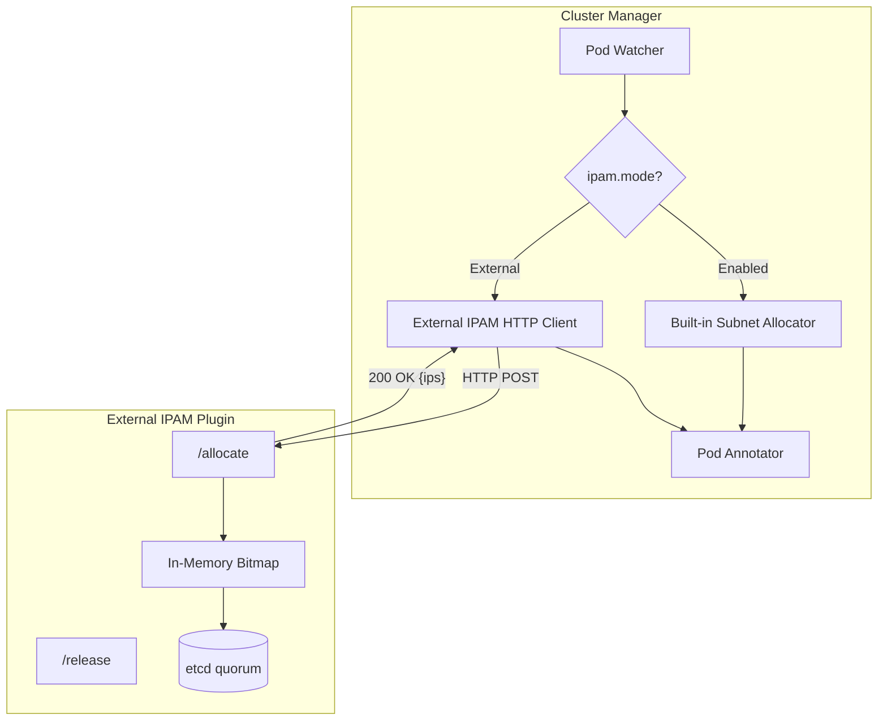
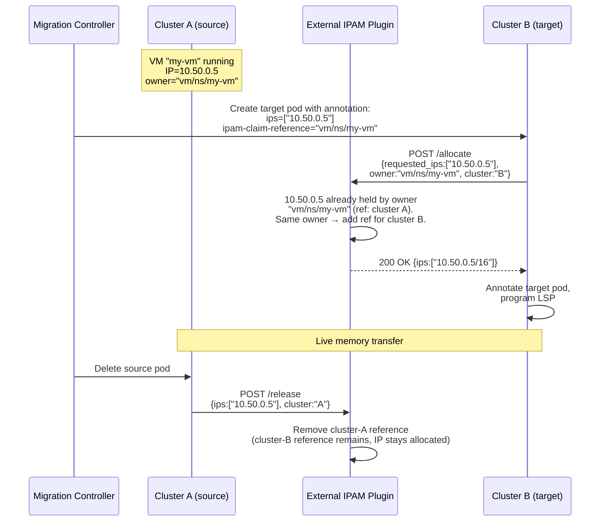

# OKEP-6831: External IPAM Plugin Support

* Issue: [#6831](https://github.com/ovn-kubernetes/ovn-kubernetes/issues/6831)

## Problem Statement

OVN-Kubernetes supports three IPAM modes for User Defined Networks:
`Enabled` (OVN-Kubernetes allocates from subnets), `Disabled` (no IP assignment,
Secondary only), and `DHCP` (delegates to external DHCP server, Secondary
Localnet only per [OKEP-6224](okep-6224-dhcp-ipam-localnet.md)). There is no mechanism to delegate IP
allocation to an external service for **primary Layer2 UDNs/CUDNs** — the
topology used for stretched L2 networks across clusters. Multi-cluster
deployments need a centralized IPAM service to allocate IPs from a single
flat pool across all clusters, guaranteeing uniqueness without CIDR
partitioning or address waste.

## Goals

- Introduce a new IPAM mode (`External`) for **primary** Layer2
  CUDNs/UDNs that delegates IP allocation to an external HTTP-based
  IPAM service.
- Support multi-cluster deployments where a single external IPAM
  instance manages a flat IP pool across all clusters.
- Define a stable HTTP API contract between OVN-Kubernetes and external
  IPAM plugins.
- Enable OVN-Kubernetes to call the external plugin during pod
  scheduling, receive an IP allocation, annotate the pod, and program
  the OVN logical switch port — all transparently to the workload.
- Support static IP requests via the existing OKEP-5233 pod annotation
  (`v1.multus-cni.io/default-network` with `ips` field), routed
  through the external plugin as `requested_ips`.
- Deliver a production-ready external IPAM service, **Atlas IPAM**
  (`atlas-ipam`), under the `ovn-kubernetes` GitHub organization. It
  should be deployable and operable in production out of the box: highly
  available, durable, and observable. As the
  first conforming backend, Atlas also
  serves as the worked example of the HTTP API contract, so third parties
  can build their own backends against it (see
  [Future Goal: Enterprise DHCP/DDI Integration](#future-goal-enterprise-dhcpddi-integration)),
  and it is what CI workflows and e2e tests run against.
- Support cross-cluster live VM migration IPAM by introducing
  owner-based allocation semantics: the same logical entity (VM) can
  re-acquire its IP on a different cluster without conflict.
- Support overlapping IP address spaces across different networks:
  the plugin tracks allocations per-network, allowing the same IP
  range to be used independently by different UDNs without conflict.
- Support IPv4-only, IPv6-only, and dual-stack pools from day one. The
  plugin allocates from whichever address families a network is
  configured with; a dual-stack network yields one IPv4 and one IPv6
  address per attachment, tracked as distinct allocations under the same
  owner.
- Support multiple IPs per address family on a single workload
  attachment. The plugin API should be designed to allocate more than
  one IPv4 (or IPv6) address per pod interface on the same network,
  so that when OVN-Kubernetes gains multi-IP-per-family-per-network
  support the plugin contract does not need to change.
- High availability from day 0: Atlas IPAM must support multiple
  replicas with leader election so that IP allocation is not a single
  point of failure. Active-passive failover with state replication
  ensures zero downtime during upgrades and node failures.
- Platform-agnostic API and deployment: the Atlas IPAM HTTP contract
  uses opaque `workload_id` strings (not Kubernetes-specific fields
  like pod/namespace) and runs as a standalone Go binary that can be
  deployed on Kubernetes, bare-metal, or VMs. Non-Kubernetes callers
  (e.g. VMware vSphere, OpenStack Neutron) can use the same API by
  constructing `workload_id` from platform-native identifiers.

## Future Goals

- Supporting `External` mode on Layer3 Primary Networks and
  Layer3/Layer2/Localnet Secondary Networks.
- Supporting `External` mode on the Cluster Default Network (CDN).
  The initial scope targets User Defined Networks; extending it to the
  CDN is a separate use case focused on centralized allocation and
  governance of the default network.
- Integration with enterprise IPAM systems (Infoblox, BlueCat) via
  adapter plugins (see
  [Enterprise DHCP/DDI Integration](#future-goal-enterprise-dhcpddi-integration)).
- Integration with [NetBox](https://netbox.readthedocs.io/) as a
  persistence backend, so that all pod IP allocations
  are visible in a single-pane-of-glass IPAM tracking system alongside
  the rest of the organization's network infrastructure.
## Non-Goals

- Replacing the existing `Enabled` IPAM mode for clusters that do not
  need external orchestration.
- Implementing a full-featured enterprise IPAM system within
  OVN-Kubernetes itself.
- Surviving the loss of the *entire* hub cluster. Node, AZ, and
  single-site failures are covered by the baseline HA (a dedicated etcd
  quorum spread across failure domains; see
  [High Availability and DB Replication](#high-availability-and-db-replication)).
  Recovering from a full hub loss is standard
  regional disaster recovery (etcd snapshot and restore, or a standby
  hub) handled at the platform level, not something this feature
  designs. The `store/` interface does not preclude a cross-cluster
  replicated backend later, but no such replication or failover
  procedure is specified here.
- Implementing DHCP-based IPAM (covered by OKEP-6224, supports
  Secondary Localnet only).
- Supporting mutation of an `External`-mode network's IPAM
  configuration (subnets, `externalIPAM` endpoint, mode) after
  creation. The initial implementation treats this configuration as
  immutable — corrections require deleting and recreating the network.
  Mutable/UPDATE support may be revisited if the use case (e.g.
  correcting a misconfigured network without tearing down existing
  workloads) gains traction.
- Supporting mutation of a workload's requested IP after it has been
  allocated. The IP bound to a workload endpoint is immutable for the
  lifetime of that workload — changing it requires recreating the
  workload so it goes through a fresh allocation.

## Introduction

Multi-cluster Kubernetes deployments increasingly require stretched L2
networks — a single broadcast domain spanning multiple clusters — for
workload mobility, disaster recovery, and simplified service discovery.
OVN-Kubernetes supports EVPN (OKEP-5088) which enables Layer 2 UDN
segments to be stretched across the external network fabric using
MAC-VRFs and VXLAN. This is critical for VM migration: a VM can
migrate from an external provider network into a Kubernetes cluster
(or between clusters) while preserving its IP and MAC address,
because both endpoints share the same L2 broadcast domain via EVPN.

OKEP-5088 explicitly lists "interconnecting two Kubernetes clusters
with EVPN and allowing VM migration across them" as a future goal.
This OKEP provides the IPAM component needed to realize that goal:
when pods or VMs across clusters share the same L2 EVPN subnet, IP
address uniqueness must be enforced globally, not per-cluster.

Without a centralized allocator, the only alternative is to
pre-partition the subnet into per-cluster blocks using
`reservedSubnets`. For example, splitting a /16 across 10 clusters
means each cluster gets a /20 (4096 IPs). This approach has serious
drawbacks:

- **Address waste**: A cluster running 50 pods still consumes a /20.
  At 100 clusters the waste is enormous.
- **Rigid planning**: The operator must predict per-cluster capacity
  upfront. Growing a cluster beyond its partition requires subnet
  re-planning and potential IP renumbering.
- **No workload mobility**: Moving a VM from cluster A to cluster B
  means it must change IP (its old IP belongs to A's partition),
  breaking existing connections and firewall rules.
- **Combinatorial complexity**: Dual-stack, multiple subnets per AND,
  and heterogeneous cluster sizes make the partition math unwieldy
  and error-prone.
- **Churn on cluster add/remove**: Adding a cluster means carving a
  new partition out of the pool (and possibly renumbering existing
  ones to make room); removing a cluster strands its partition until
  it is manually reclaimed. Neither is a trivial, self-service
  operation — each requires re-planning the global CIDR layout.

A centralized external IPAM service eliminates all of these issues by
allocating from a single flat pool on demand.

Note that the **address-waste** drawback is predominantly an **IPv4**
concern. IPv6's vast address space makes per-cluster slicing far less
wasteful — a /64 per cluster carved out of a larger prefix costs
effectively nothing in address terms. The remaining drawbacks (rigid
planning, no workload mobility, combinatorial complexity, and churn on
cluster add/remove) still apply to IPv6, but the primary motivation
for a flat pool — avoiding exhaustion and waste — is IPv4-driven.

This is a motivation, not a mode split: when `External` mode is enabled
on a network, it owns allocation for every address family that network is
configured with (IPv4, IPv6, or both). We don't mix authorities per
family (for example External for IPv4 while the built-in allocator slices
IPv6), since that would give a single dual-stack network two IPAM
authorities and complicate the allocation contract, the pod annotation,
and LSP programming. Keeping `External` uniform across families also
keeps the cross-cluster migration story simple: a dual-stack VM keeps all
of its addresses through the same owner-based concurrent references, with
no special-casing for IPv6.

Today, OVN-Kubernetes offers two relevant modes for primary Layer2 UDNs:

- `Enabled`: OVN-Kubernetes's built-in allocator manages IPs, but it operates
  per-cluster with no cross-cluster coordination.
- `Disabled`: Only supported for Secondary networks. Even if it were
  available for Primary, it provides no automation — someone must
  statically assign every IP.

The `DHCP` mode (OKEP-6224) delegates to an external DHCP server but is
restricted to Secondary Localnet networks, requires L2 reachability to
the DHCP server at CNI ADD time, and doesn't fit the Primary L2 overlay
multi cluster IPAM use case.

## User-Stories/Use-Cases

### Story 1: Multi-Cluster Flat IP Pool

As a platform operator running stretched L2 networks across multiple
clusters, I want all pods on the same primary Layer2 UDN to receive
unique IPs from a single flat pool without pre-partitioning CIDRs per
cluster, so that I can schedule workloads freely across clusters without
address conflicts or wasted IP space.

For example: with `reservedSubnets` partitioning, an operator must
manually divide a /16 into per-cluster blocks (e.g. /20 per cluster),
predict per-cluster capacity upfront, and recalculate whenever clusters
are added or workload distribution shifts. Every major CNI that
supports multi-cluster networking today imposes this same constraint —
non-overlapping CIDRs must be manually planned per cluster:

- [Cilium Cluster Mesh](https://docs.cilium.io/en/latest/network/clustermesh/setup/):
  Requires "PodCIDR ranges in all clusters must be non-conflicting
  and unique." Each cluster is manually assigned a disjoint range
  (e.g. cluster1: 10.1.0.0/16, cluster2: 10.2.0.0/16). No shared
  flat pool.
- [Calico Cluster Mesh](https://docs.tigera.io/calico-cloud/multicluster/kubeconfig):
  Supports multi-cluster via VXLAN overlay or BGP underlay, but
  requires "Pod CIDRs between clusters must not overlap." IPAM
  remains per-cluster; the operator ensures uniqueness manually.
- [Kube-OVN (OVN-IC)](https://kubeovn.github.io/docs/v1.14.x/en/advance/with-ovn-ic/):
  Interconnects clusters via OVN-IC tunnels, but requires "subnet
  CIDRs in different clusters MUST NOT be overlapped" for
  auto-routing. Overlapping subnets need manual route configuration.
- [AWS VPC CNI](https://aws.amazon.com/blogs/containers/amazon-vpc-cni-increases-pods-per-node-limits/):
  Assigns pod IPs from VPC subnets. Multi-cluster is achieved via
  VPC peering or Transit Gateway, but the operator must ensure VPC
  CIDRs don't overlap. No automated cross-cluster IPAM exists.

None of these provide a single flat IP pool with automated
cross-cluster allocation, nor do they support multi-network (multiple
isolated subnets per cluster with overlapping address spaces). They
all push the CIDR partitioning burden
onto the operator. A centralized external IPAM eliminates this
planning entirely — allocations come from a single flat pool on
demand, regardless of which cluster or node the pod lands on.

### Story 2: Enterprise IPAM Integration (In Future)

As a network administrator, I want OVN-Kubernetes to delegate IP
allocation for primary UDN pods to my existing enterprise IPAM system
(via an HTTP adapter), so that Kubernetes workloads follow the same IP
governance and audit trail as my non-Kubernetes infrastructure.

### Story 3: Controlled IP Assignment for Compliance

As a security engineer, I want IP allocations for sensitive workloads on
isolated primary UDNs to be managed by a central service with audit
logging, so that I can track which pod received which IP and when,
across all clusters in the fleet.

### Story 4: IP Recycling

As a cluster operator, I want an IP to be reclaimed once the workload
that held it is gone, so that the address returns to the pool and
future workloads can use it — without any address leaking permanently
out of the usable range.

### Story 5: Static IP / Pre-Reserved Address

As a virtualization operator, I want to assign a specific IP from the
network's subnet to a particular VM (or pod) and have the external
IPAM honor and reserve exactly that address, so that workloads with
fixed-address requirements — licensing tied to an IP, firewall rules,
externally published endpoints — keep the same address across
restarts and reschedules. The allocator must reject the request if
that address is already held by a different workload.

### Story 6: Cross-Cluster Live VM Migration

As a platform operator, I want a virtual machine live-migrating from
cluster A to cluster B to retain its IP address seamlessly, so that
existing connections, DNS records, and firewall rules remain valid
without manual reconfiguration after migration completes.

### Story 7: Cross-Platform Migration

As an infrastructure team migrating a fleet of VMs from an existing
platform into Kubernetes — VMware vSphere to OpenShift Virtualization
(KubeVirt), or between any two platforms that share an L2 domain — I
want OVN-Kubernetes to delegate to the **same** Atlas IPAM instance that
already governs the source environment, so one authority tracks every
allocation across both sides for the whole migration. Atlas serves the
legacy platform and the Kubernetes target simultaneously, so VMs move at
whatever pace the team chooses (weeks or months) while keeping their
IPs, and the two sides can never hand out the same address. I do not
have to reconcile two independent IP databases or freeze allocations
while the migration is in flight. Once it completes, Atlas serves the
Kubernetes platform alone with no reconfiguration. The requirement is
explicit: both environments must point at one shared external IPAM —
separate per-platform allocators reintroduce exactly the
cross-environment conflict this feature exists to eliminate.

## Proposed Solution

This OKEP introduces `ipam.mode: External`, which tells OVN-Kubernetes
to call an external HTTP endpoint for each pod that needs an IP on a
primary Layer2 UDN. The external service owns the allocation logic,
collision avoidance, and persistence. OVN-Kubernetes handles everything
downstream: annotating the pod, programming the OVN logical switch port,
and releasing the IP on pod deletion.

This is a generic extension point. Any external IPAM system that
implements the HTTP contract can serve as the backend — from the
first-party Atlas allocator to enterprise systems like Infoblox or BlueCat.
Network orchestrators that create L2 EVPN subnets via CUDNs across
clusters are one consumer, but the feature is not specific to any
single orchestrator.

### Architecture Overview



**TBD (to be resolved during review):** Whether the external IPAM
call should be made by the cluster-manager (as proposed above) or by
ovnkube-node directly (similar to the DHCP OKEP-6224 flow where
ovnkube-node handles IPAM during CNI ADD). There may be advantages
to having ovnkube-node call the plugin — it avoids the pod annotation
round-trip entirely if ovnkube-controller and ovnkube-node are
eventually combined into a single process (eliminating the need for
the annotation as the coordination mechanism). For now, the
cluster-manager approach is proposed because L2 IPAM is already
centralized there, and ovnkube-controller relies on the pod
annotation to program the logical switch port — so something must
annotate regardless, keeping changes minimal with this approach.
This is open for discussion.

### External IPAM Plugin

#### API Style: RPC over HTTP

The plugin exposes an **open plugin interface** — any conforming
backend can implement it, from the first-party Atlas
allocator to enterprise IPAM systems like Infoblox, BlueCat, or NetBox. The
`externalIPAM.url` and `caBundle` fields in the CUDN spec point
OVN-Kubernetes at whichever implementation is deployed.

The API uses **RPC-style HTTP** — all endpoints are action-oriented
POSTs with JSON request/response bodies:

- `POST /register` — register a network pool
- `POST /deregister` — remove a network pool
- `POST /allocate` — allocate an IP for a pod
- `POST /release` — release an IP for a pod
- `GET /status` — health check and pool statistics

RPC-style is chosen over REST because:

1. **Well-defined plugin contract** — the client (OVN-Kubernetes) knows the
   exact endpoints at compile time. Third-party implementors get a
   flat, explicit handler map with no REST routing conventions to
   learn.
2. **No URL encoding issues** — network names stay in the JSON body,
   avoiding path-encoding problems with dots, slashes, or other
   characters.
3. **Single validation path** — all request context is in the body,
   parsed and validated in one place.
4. **Alignment with enterprise IPAM APIs** — the enterprise systems
   we expect to integrate with (Infoblox WAPI, BlueCat Address
   Manager REST, NetBox) all already expose REST/HTTP+JSON APIs with
   "next-available-IP" semantics. Keeping our contract HTTP/JSON makes
   a translation adapter a thin, same-protocol shim rather than a
   protocol bridge, and lets a provider ship its own conforming
   backend with minimal effort. Choosing gRPC would force every such
   adapter to bridge protocols.

gRPC (protobuf over HTTP/2) would offer marginally better
serialization performance, but adds protobuf schema management and
code generation overhead. Since the IPAM hot path is dominated by
the persistence write, not JSON parsing, HTTP/JSON is the
pragmatic choice — and, as noted above, it matches the REST APIs the
enterprise IPAM backends already speak, which is a decisive factor for
the adapter model. gRPC may be added as an optional transport in a
future iteration.

### API Details

#### New IPAM Mode

Extend the `IPAMMode` enum:

```diff
- // +kubebuilder:validation:Enum=Enabled;Disabled;DHCP
+ // +kubebuilder:validation:Enum=Enabled;Disabled;DHCP;External
type IPAMMode string

const (
    IPAMEnabled  IPAMMode = "Enabled"
    IPAMDisabled IPAMMode = "Disabled"
    IPAMDHCP     IPAMMode = "DHCP"
+   IPAMExternal IPAMMode = "External"
)
```

#### New ExternalIPAM Configuration

Add an `ExternalIPAM` struct to the IPAM configuration:

```diff
type IPAMConfig struct {
    // Mode controls IP allocation strategy.
    // +optional
    Mode IPAMMode `json:"mode,omitempty"`

    // Lifecycle controls IP lifecycle (Persistent for IPAMClaims).
    // +optional
    Lifecycle NetworkIPAMLifecycle `json:"lifecycle,omitempty"`

+   // ExternalIPAM configures the external IPAM plugin endpoint.
+   // Required when mode is "External".
+   // +optional
+   ExternalIPAM *ExternalIPAMConfig `json:"externalIPAM,omitempty"`
}

+ // ExternalIPAMConfig defines the connection parameters for an
+ // external IPAM service.
+ type ExternalIPAMConfig struct {
+     // Name is a human-readable identifier for this external IPAM
+     // plugin instance. Used in logs, events, and status conditions
+     // to distinguish between different plugin backends.
+     // Example: "prod-ipam", "infoblox-east"
+     //
+     // +kubebuilder:validation:Required
+     // +kubebuilder:validation:MinLength=1
+     // +required
+     Name string `json:"name"`
+
+     // URL is the base URL of the external IPAM plugin HTTP endpoint.
+     // Must be a valid HTTP or HTTPS URL whose host is resolvable and
+     // routable from the node network namespace (see "Reachability"): a
+     // NodePort, LoadBalancer, Ingress hostname, or external DNS name.
+     // A *.svc.cluster.local name will NOT resolve for this client.
+     // Example: "https://external-ipam.example.net:9500"
+     //
+     // +kubebuilder:validation:Required
+     // +kubebuilder:validation:Pattern=`^https?://`
+     // +required
+     URL string `json:"url"`
+
+     // CABundle is a PEM-encoded CA certificate bundle for validating
+     // the plugin's (server's) TLS certificate. If unset and URL is
+     // HTTPS, the system trust store is used.
+     // +optional
+     CABundle []byte `json:"caBundle,omitempty"`
+
+     // ClientCertSecretRef references a Secret (type kubernetes.io/tls)
+     // holding the client certificate and key this cluster presents to
+     // the plugin for mutual TLS. This is how the calling cluster proves
+     // its own identity to the plugin; CABundle, by contrast, is how it
+     // verifies the plugin. Mutually exclusive with TokenSecretRef.
+     // +optional
+     ClientCertSecretRef *corev1.SecretReference `json:"clientCertSecretRef,omitempty"`
+
+     // TokenSecretRef references a Secret holding a bearer token this
+     // cluster presents on each request (Authorization: Bearer <token>)
+     // as an alternative to mutual TLS. Mutually exclusive with
+     // ClientCertSecretRef.
+     // +optional
+     TokenSecretRef *corev1.SecretReference `json:"tokenSecretRef,omitempty"`
+
+     // TimeoutSeconds is the maximum time to wait for a response from
+     // the plugin. Defaults to 10 seconds.
+     // +optional
+     // +kubebuilder:validation:Minimum=1
+     // +kubebuilder:validation:Maximum=60
+     // +kubebuilder:default=10
+     TimeoutSeconds int32 `json:"timeoutSeconds,omitempty"`
+ }
```

**What this config is (and isn't).** `ExternalIPAMConfig` is a
**connection descriptor**, not a place to configure the backend. It
carries only what OVN-Kubernetes — as the HTTP *client* — needs to reach
and trust the plugin: where it is (`url`), how to verify it (`caBundle`),
how to authenticate to it (`clientCertSecretRef` / `tokenSecretRef`), and
how long to wait (`timeoutSeconds`). These are identical concerns
regardless of which backend (Atlas, Infoblox, BlueCat, …) sits behind the
URL. Everything about *how the plugin does its job* — pool policies,
recycling/cooldown timers, DHCP/DDI credentials, DNS backends — is the
plugin operator's concern and lives in the plugin's own deployment
(its ConfigMap/CRD/flags), opaque to OVN-Kubernetes. This is deliberate:
keeping the type structured and backend-agnostic (rather than an
unstructured `map`/`RawExtension` grab-bag) preserves CRD-level
validation, keeps OVN-Kubernetes's API decoupled from any specific vendor,
and puts backend tuning with the team that owns the IPAM service rather
than in the CUDN authored by whoever creates networks.

**Which side holds this, and the direction of auth.** In a multi-cluster
deployment the plugin (server) runs in the hub; each participating
cluster carries its **own** copy of the CUDN, and *that cluster's*
`ovnkube-cluster-manager` is the client that reads this config to call
the plugin. So the config is client-side, and the credential direction is
cluster → plugin: `caBundle` verifies the plugin's server certificate,
while `clientCertSecretRef`/`tokenSecretRef` are how the calling cluster
proves its identity **to** the plugin. Credentials may differ per cluster,
which lets the plugin authenticate — and, if it chooses, authorize or
rate-limit — each cluster rather than blindly trusting the `cluster`
field in the request body. There is no hub→spoke config push: each
cluster's CUDN (and its referenced Secrets) is provisioned independently,
by an orchestrator or by the operator.

**Where TLS terminates decides which credentials the plugin can
enforce.** These three fields depend on where the TLS connection is
terminated on the server side, which is a deployment choice (see
[TLS Termination and Exposure](#tls-termination-and-exposure)).
`caBundle` verifies whatever server certificate the client's TLS
handshake reaches: the plugin itself with end-to-end TLS, or a fronting
gateway/load balancer when TLS is terminated at the edge. A bearer token
(`tokenSecretRef`) travels in the `Authorization` header and is forwarded
unchanged through a terminating gateway, so the plugin can validate it
regardless of where TLS ends. A client certificate
(`clientCertSecretRef`) is consumed by whoever completes the TLS
handshake: if a gateway terminates TLS, the gateway sees and verifies the
client certificate, and must be configured to enforce it (or to
re-present an identity to the plugin on the second hop). For the plugin to
verify each calling cluster's client certificate itself, TLS has to reach
the plugin unterminated (end-to-end mTLS). This is why Atlas terminates
TLS itself: on bare-metal/VM deployments there is no gateway to rely on.
See [TLS Termination and Exposure](#tls-termination-and-exposure) for the
two supported Gateway API shapes and how each maps onto these fields.

**Interaction with `Lifecycle`**: The existing `Lifecycle` field
continues to apply to `External` networks. `Lifecycle: Persistent`
is what drives IPAMClaim creation for KubeVirt VMs, and it composes
naturally with external IPAM: the IPAMClaim identity is passed to the
plugin as the `owner` field on `/allocate`, so a VM re-acquires its
persisted IP on restart, reschedule, or cross-cluster migration. In
other words, OVN-Kubernetes still tracks *that* the IP is persistent
(via the IPAMClaim), while the external plugin is the source of truth
for *which* IP that is. `Lifecycle` defaulting/absence behaves exactly
as it does for `Enabled` mode.

#### CRD Validation Rules

```yaml
# Layer2 topology validations for External mode:
- message: "External ipam.mode requires externalIPAM configuration"
  rule: >-
    !has(self.ipam) || !has(self.ipam.mode) ||
    self.ipam.mode != "External" ||
    (has(self.ipam.externalIPAM) && has(self.ipam.externalIPAM.url))

- message: "Subnets are required when ipam.mode is External"
  rule: >-
    !has(self.ipam) || !has(self.ipam.mode) ||
    self.ipam.mode != "External" || has(self.subnets)

- message: "externalIPAM must be unset when ipam.mode is not External"
  rule: >-
    !has(self.ipam) || !has(self.ipam.externalIPAM) ||
    (has(self.ipam.mode) && self.ipam.mode == "External")

- message: "External ipam.mode is only supported for Primary network"
  rule: >-
    !has(self.ipam) || !has(self.ipam.mode) ||
    self.ipam.mode != "External" || self.role == "Primary"

- message: "externalIPAM.clientCertSecretRef and externalIPAM.tokenSecretRef are mutually exclusive"
  rule: >-
    !has(self.ipam) || !has(self.ipam.externalIPAM) ||
    !(has(self.ipam.externalIPAM.clientCertSecretRef) &&
      has(self.ipam.externalIPAM.tokenSecretRef))

# Layer3Config and LocalnetConfig — reject External mode entirely:
- message: "External ipam.mode is only supported for Layer2 topology"
  rule: >-
    !has(self.ipam) || !has(self.ipam.mode) ||
    self.ipam.mode != "External"
```

Note: `External` mode is restricted to **primary Layer2 UDNs** because:

1. Primary L2 is the topology used for stretched multi-cluster subnets
   (EVPN).
2. For L2, IPAM is managed by cluster-manager (centralized), making it
   natural to delegate outward.
3. For L3, IPAM is per-node (distributed), which doesn't map to a
   centralized external service.
4. Secondary networks already have `Disabled` mode available for
   manual/external IP management.

Unlike `Disabled` mode, `External` mode **requires** the `subnets`
field so that OVN-Kubernetes knows the address space (for gateway IP
derivation, route injection, port security ranges). The external plugin
is responsible for allocating within that range, but OVN-Kubernetes needs the
subnet metadata for datapath programming.

#### Example ClusterUserDefinedNetwork

```yaml
apiVersion: k8s.ovn.org/v1
kind: ClusterUserDefinedNetwork
metadata:
  name: blue-network
spec:
  namespaceSelector:
    matchLabels:
      network.example.io/subnet: "blue"
  network:
    topology: Layer2
    layer2:
      role: Primary
      subnets:
        - "10.50.0.0/16"
      ipam:
        mode: External
        externalIPAM:
          url: "https://external-ipam.example.net:9500"
          timeoutSeconds: 5
```

#### External IPAM Plugin HTTP API Contract

The external plugin MUST implement the following HTTP endpoints. For
brevity the paths below are written without the API version prefix; the
wire paths are prefixed with the major version (`/v1/register`,
`/v1/allocate`, …) as described under
[API Versioning and Compatibility](#api-versioning-and-compatibility).

##### HTTP Conventions

The contract does not invent its own HTTP semantics. Status codes,
methods, and caching follow **[RFC 9110 (HTTP
Semantics)](https://www.rfc-editor.org/rfc/rfc9110)**, and every error
response body is an **[RFC 9457 (Problem Details for HTTP
APIs)](https://www.rfc-editor.org/rfc/rfc9457)** object
(`Content-Type: application/problem+json`) with at least `type`,
`title`, `status`, and `detail`. Successful requests carry
`Content-Type: application/json`. Defining these once here means each
endpoint below only has to name *which* codes it returns and what they
mean for that specific call — it does not restate the semantics.

**Success codes.** A successful response returns `200 OK` when it
carries a body (`/allocate`, `/status`) and `204 No Content` when it does
not (`/register`, `/deregister`, `/release`). Empty successes are
therefore `204` with no body, not `200 {}`.

**Status codes used by this contract:**

| Code | Meaning | OVN-Kubernetes behavior |
|------|---------|-------------------------|
| `200 OK` | Success, with a JSON body | Consume the body |
| `204 No Content` | Success, no body | Treat as success |
| `400 Bad Request` | Malformed or invalid request (bad CIDR, missing required field) | **Terminal** — do not retry; surface a condition on the network |
| `404 Not Found` | Unknown endpoint or, where applicable, unknown network | **Terminal** — surface a condition |
| `409 Conflict` | State conflict; endpoint-specific meaning (e.g. IP held by a different owner on `/allocate`; non-empty pool on `/deregister`) | **Terminal** — surface to the user |
| `429 Too Many Requests` | Server-side rate limiting; carries `Retry-After` | **Retriable** — back off per `Retry-After` |
| `500 Internal Server Error` | Unexpected plugin failure | **Retriable** — bounded exponential backoff |
| `503 Service Unavailable` | Plugin reachable but not ready (DB syncing, no quorum); carries `Retry-After` | **Retriable** — retry per `Retry-After` |

**Retry and idempotency.** Only `429`, `500`, `503`, and transport-level
failures (connection refused, timeout) are retriable; OVN-Kubernetes
places these on its persistent retry-until-success queue. All other
`4xx` codes are terminal — retrying will not change the outcome, so
OVN-Kubernetes surfaces the error rather than looping. Retries are safe
because the mutating endpoints are idempotent on their identity tuples
(see the idempotency notes under [`/allocate`](#post-allocate) and
[`/release`](#post-release)). Servers that emit `429`/`503` SHOULD set
`Retry-After`; clients MUST honor it when present and fall back to
exponential backoff when absent.

##### POST /register

Called by cluster-manager when a network with `ipam.mode: External`
is created (i.e., when `NewNetworkController` is invoked for the
network). This gives the plugin advance knowledge of the pool,
allowing it to pre-allocate bitmaps and validate the subnet.

Request:
```json
{
  "network": "blue-network",
  "subnets": ["10.50.0.0/16"],
  "cluster": "us-east-1",
  "exclude_ips": ["10.50.0.1"]
}
```

Field semantics:

- `network`: The network name (from the UDN/CUDN `.spec.network`).
- `subnets`: The CIDR ranges for the pool.
- `cluster`: Identity of the calling cluster.
- `exclude_ips` (optional): IPs that must never be allocated (e.g.,
  gateway IPs derived by OVN-Kubernetes from the subnet).

Response: `204 No Content` (no body).

**Idempotency**: If the network is already registered (same name and
subnets), the plugin returns `204`. If the same network is registered
with different subnets, the plugin returns `409 Conflict` — subnet
changes require deregister + re-register.

**TBD**: Whether the plugin should allow subnet *additions* (e.g.,
adding a secondary CIDR to an existing network) without requiring a
full deregister + re-register cycle. Removals would never be allowed
as they could orphan existing allocations.

Returns: `204` on success; `409 Conflict` (already registered with
different subnets); `400 Bad Request` (invalid parameters). See
[HTTP Conventions](#http-conventions) for shared semantics.

##### POST /deregister

Called by cluster-manager when a network with `ipam.mode: External`
is deleted (i.e., during `networkClusterController.Cleanup()`). This
tells the plugin to drop the network pool for the given cluster.

By the time `/deregister` is called, OVN-Kubernetes has already deleted
the network's pods and issued `/release` for each of their allocations
(pod deletion precedes network teardown), so the pool is normally
already empty. `/deregister` is therefore the final teardown step, not
the mechanism that frees live allocations.

Request:
```json
{
  "network": "blue-network",
  "cluster": "us-east-1"
}
```

Response: `204 No Content` (no body).

In the baseline contract there is nothing to report: a non-empty pool is
rejected (see below) and an empty pool frees nothing, so a successful
deregister always releases zero allocations. It is therefore a bodyless
`204`, and is idempotent — deregistering an already-deregistered (or
never-registered) network also returns `204`. A `released_count` field
would only ever be non-zero under a force-wipe, so it is deferred to the
future `force` feature and added then as an optional response field (a
backwards-compatible change per
[API Versioning and Compatibility](#api-versioning-and-compatibility)).

**Refusing to drop a non-empty pool.** On a shared multi-cluster flat
pool, silently wiping a network that still has live allocations is
dangerous: the freed IPs become available for reallocation (to another
cluster, or to a re-registered network) while the original workloads are
still using them, causing duplicate-IP conflicts on the stretched L2
segment. So if allocations still exist for `(network, cluster)`, the
plugin **rejects** the request with `409 Conflict` and reports the
outstanding count rather than freeing IPs that are potentially still in
use. OVN-Kubernetes treats the `409` as a signal to retry teardown until
its own per-pod `/release` calls have drained the pool. This makes
accidental or racy network deletion safe by default and needs nothing
extra from OVN-Kubernetes, whose teardown path always releases pods
first.

Force-wiping a non-empty pool (an administrative override to clean up
orphaned allocations, e.g. after a cluster is decommissioned) is **not**
part of this contract. If it is ever needed it can be added later as an
optional `force` request field without breaking existing callers.

Returns: `204 No Content` on success; `409 Conflict` (allocations still
exist for `(network, cluster)` — retry until drained, see above). See
[HTTP Conventions](#http-conventions) for shared semantics.

---

**Idempotency requirement**: The `/allocate` endpoint MUST be
idempotent on the tuple `(network, cluster, workload_id)`. If the
plugin already has an allocation for the same workload, it MUST return
the previously allocated IP rather than allocating a new one. This
ensures that network outages or caller crashes between receiving the
allocation and acting on it do not cause IP leaks — the caller simply
retries the same request and gets the same answer.

##### POST /allocate

Request:
```json
{
  "network": "blue-network",
  "subnets": ["10.50.0.0/16"],
  "workload_id": "tenant-a/my-pod-abc123",
  "cluster": "us-east-1",
  "requested_ips": ["10.50.0.5/16"],
  "owner": "vm/tenant-a/my-vm",
  "metadata": {
    "namespace": "tenant-a",
    "pod": "my-pod-abc123",
    "node": "worker-3"
  }
}
```

Field semantics:

- `network`: The network name (from the UDN/CUDN `.spec.network`).
- `subnets`: The CIDR ranges for the pool.
- `workload_id`: An opaque string that uniquely identifies the
  workload **within** the cluster. The plugin does not parse or
  interpret this value — it is used purely as a key for idempotency
  and tracking. The caller constructs it from whatever identifiers
  are natural for the platform (e.g., Kubernetes uses
  `namespace/pod`, VMware vSphere uses `datacenter/vm-moref`,
  OpenStack uses `project/instance-uuid`).
- `cluster`: Identity of the calling cluster. Together with
  `workload_id`, forms the globally unique idempotency key
  `(network, cluster, workload_id)`.
- `requested_ips` (optional): When present, the plugin allocates
  exactly these IPs. When absent, the plugin allocates the next
  available IP(s) from the pool. In OVN-Kubernetes, this field is
  populated when the pod carries a static IP request via the
  `v1.multus-cni.io/default-network` annotation (OKEP-5233).
- `owner` (optional): A stable identity for the logical entity that
  owns IPs across workload lifecycles and cluster boundaries.
  In OVN-Kubernetes, derived from the `ipam-claim-reference` field
  in the pod's network selection annotation. Used for cross-cluster
  live VM migration: when the same owner requests an
  already-allocated IP, the plugin adds a reference for the requesting
  cluster instead of rejecting it as a conflict. Nothing is moved —
  during the migration window the source and target clusters hold
  references to the *same* allocation concurrently.

    **An owner MAY hold multiple allocations.** The owner→allocation
    relationship is one-to-many: a single owner legitimately holds more
    than one IP — a dual-stack owner holds an IPv4 *and* an IPv6
    allocation (both returned in one `/allocate`'s `ips`, but two
    distinct allocations), and an owner with multiple attachments to the
    same network holds one allocation per interface. Plugins MUST model
    this from the outset. Migration therefore operates on the whole
    owner: every allocation it holds is referenced by both the source
    and target clusters concurrently for the duration of the window; see
    [Cross-Cluster Live VM Migration](#cross-cluster-live-vm-migration-cclvm).
- `metadata` (optional): An opaque key-value map for caller-specific
  context (e.g., node name, zone, rack). The plugin MAY log or store
  this for debugging/audit but MUST NOT use it for allocation
  decisions.

Plugin allocation logic:

```
if requested_ips is absent:
    if owner is set AND owner already has allocation(s) on this network:
        → return the owner's existing IP(s); do NOT allocate new ones
          (add a reference for the requesting cluster if not already held,
           so the allocation is co-held during a migration window)
    else:
        → allocate next available IP(s) from pool
    → return the IP(s)

if requested_ips is present:
    if IP is free:
        → allocate it
    elif IP is allocated AND owner matches:
        → add a reference for the requesting cluster
          (allocation is co-held; nothing is overwritten)
    elif IP is allocated AND owner differs (or no owner):
        → reject: 409 Conflict
```

The owner check in the dynamic (`requested_ips` absent) branch is
essential: a returning owner — a pod restart, or a VM re-acquiring its
address on the migration target — must get **back its existing
allocation**, not a freshly allocated IP. Skipping this check would leak
the owner's original IP and hand it a different one, breaking both
idempotency and the co-held-during-migration invariant. It is the
dynamic-path counterpart of the `owner matches` branch above.

Response (200 OK):
```json
{
  "ips": ["10.50.0.5/16"]
}
```

The plugin is an IP address allocator: its authoritative output is `ips`.
It does not return the gateway, MAC, or routes, because it is never told
them. `/register` gives the plugin only the `network`, `subnets`,
`cluster`, and `exclude_ips`, so it has no basis for a gateway or a
network MAC convention. Those stay OVN-Kubernetes's to derive, the same
way they are for `Enabled` mode today: OVN-Kubernetes computes the
gateway from the network's subnet/config and derives the MAC from the IP
(`IPAddrToHWAddr`), or takes the MAC from the VM's interface spec for
KubeVirt. `External` mode doesn't change where that information comes
from.

**TBD (to be resolved during review): richer per-host config modeled on
DHCP protocol options.** A future extension could let the plugin *also*
supply the per-host configuration a DHCP server would normally hand a
client (RFC 2132 / RFC 3442) — for KubeVirt VMs OVN-Kubernetes already
programs an OVN `dhcp_options` record on the logical switch port, so
these fields could be plumbed straight into it. But this is not
something a plugin can produce out of thin air: as the reviewer noted
for the gateway, the plugin only knows what it was told at `/register`.
So any such extension is inherently **two-sided** — OVN-Kubernetes would
pass the relevant network config *into* `/register`, and the plugin
could then return per-host *overrides* out of `/allocate`. The options
worth surveying, and how they would map to optional response fields:

| DHCP option | Response field | Notes |
|-------------|----------------|-------|
| 3 (Router) | `gateway` | per-host override; OVN-K must pass its derived gateway at `/register` first |
| 6 (DNS servers) | `dns_servers` | ties into the [DNS Record Management](#dns-record-management) design |
| 15 / 119 (Domain name / search list) | `domain_name`, `domain_search` | per-network today; could be per-allocation |
| 26 (Interface MTU) | `mtu` | usually a network-wide property, but DHCP allows per-host |
| 51 (Lease time) | `lease_time` | maps to the cooldown/recycling model in [Story 4](#story-4-graceful-ip-recycling) |
| 121 / 249 (Classless static routes) | `routes` | per-host route injection |
| 42 (NTP servers) | `ntp_servers` | pass-through to the VM's `dhcp_options` |
| 12 / 81 (Hostname / FQDN) | `hostname` | already derived from the VM name for KubeVirt |

These would all be **optional** response fields layered on top of the
IP-only base contract, gated on OVN-Kubernetes having first supplied the
corresponding config at `/register`. Which subset (if any) to standardize
in v1 — versus deferring to a future iteration alongside the DNS work —
is left open for review.

Returns: `200` with the allocation on success; `409 Conflict` (IP held
by a different owner, or pool exhausted); `503 Service Unavailable`
(plugin not ready — retriable); `400 Bad Request` (invalid parameters).
See [HTTP Conventions](#http-conventions) for shared semantics.

##### POST /release

Request:
```json
{
  "network": "blue-network",
  "ips": ["10.50.0.5/16"],
  "workload_id": "tenant-a/my-pod-abc123",
  "cluster": "us-east-1"
}
```

Response: `204 No Content` (no body).

`/release` is **reference-scoped**: the `(workload_id, cluster)` tuple
identifies exactly one entry in the allocation's `references` list, and
the plugin removes only that entry. The IP itself is freed (returned to
the pool) only once its *last* reference is removed. This is what makes
migration teardown simple:

- **Successful migration** — release the source reference
  (`cluster: A`); the IP stays allocated, now held solely by the target
  (`cluster: B`).
- **Failed/aborted migration** — release the target reference
  (`cluster: B`); the IP stays with the source, exactly as before the
  attempt.

In both cases the caller just releases the correct entry and the plugin
does the right thing without any special migration-abort API.

Release MUST NOT be best-effort — IP leaks are unacceptable. If the
plugin is unreachable during pod deletion, OVN-Kubernetes queues the
release in a persistent retry queue and retries with exponential
backoff until it succeeds. On cluster-manager restart, `syncPods`
detects any pods deleted while down and re-issues `/release` calls
for their allocations.

Returns: `204 No Content` on success (including releasing an
already-removed reference, which is a successful no-op); `400 Bad
Request` (invalid parameters). See
[HTTP Conventions](#http-conventions) for shared semantics.

##### GET /status

Response (200 OK):
```json
{
  "ready": true,
  "api_version": "v1",
  "supported_api_versions": ["v1"],
  "capabilities": ["owner-references", "requested-ips"],
  "pools": {
    "blue-network": {
      "subnets": ["10.50.0.0/16", "fd50::/64"],
      "usage": {
        "IPv4": { "allocated": 1523, "available": 64011 },
        "IPv6": { "allocated": 1523 }
      }
    }
  }
}
```

Used for health checks and Prometheus metric scraping. The
`api_version`, `supported_api_versions`, and `capabilities` fields are
the basis of the versioning/compatibility model described next.

**Granularity.** `/status` reports only two levels: server-wide
readiness/version/capabilities, and **per-pool aggregates**. Each pool
lists its `subnets` (one CIDR per address family — a dual-stack pool has
both) and `usage` counts **broken down by family**, since an IPv4 and an
IPv6 count do not sum meaningfully. `available` is omitted for a family
whose free-address count exceeds what an integer usefully represents
(e.g. a `/64` IPv6 pool); `allocated` is always reported. `/status` does
**not** enumerate individual allocations and has no notion of
references — it is a health/metrics endpoint, and a production pool may
hold tens of thousands of IPs. Inspecting individual allocations or
their per-reference migration state (e.g. "what does this owner hold?")
is out of scope for `/status`; if such introspection is ever needed it
would be a separate, optional read endpoint rather than an expansion of
this one.

Returns: `200` with the status body (readiness is conveyed by the
`ready` field, so the endpoint returns `200` even when `ready` is
`false`). See [HTTP Conventions](#http-conventions) for shared
semantics.

##### API Versioning and Compatibility

OVN-Kubernetes is the **client** of this contract and the external
plugin is the **server**, and the two are versioned, released, and
upgraded independently — OVN-Kubernetes ships on its own cadence, the
first-party Atlas IPAM ships on its own, and third-party/enterprise
backends ship on theirs. Neither side can assume the other is at any
particular version. The contract therefore needs an explicit
compatibility model rather than relying on lockstep upgrades.

**Versioning scheme.** The API is versioned with a single integer major
version carried in the URL path prefix (`/v1/allocate`, `/v1/register`,
…). A new major version is minted only for a **breaking** change
(removing or renaming a field, changing a field's meaning, changing an
endpoint's semantics). Backward-compatible changes — adding a new
*optional* request field (e.g. the future `force` on `/deregister`) or a
new *optional* response field (e.g. the DHCP-derived `dns_servers`,
`lease_time`, etc.) — are made **in place within the same major
version** and MUST NOT break existing clients or servers.

**Compatibility rules.** To make in-place evolution safe:

- Servers MUST ignore unknown request fields (a newer client may send a
  field an older server doesn't understand).
- Clients MUST ignore unknown response fields (a newer server may return
  a field an older client doesn't understand).
- Neither side may treat the *absence* of an optional field as an error;
  optional fields always have a defined default behavior (this is why
  `force` defaults to "reject", an absent `owner` means a plain
  IP-keyed allocation, and any future per-host fields fall back to
  values OVN-Kubernetes derives from the network config).

**Discovery and negotiation.** `GET /status` advertises the server's
`api_version` (the major version it is currently serving — `v1` today),
the full list of `supported_api_versions` it can serve concurrently, and
a `capabilities` list naming optional features it implements (e.g.
`owner-references` for cross-cluster VM migration, `requested-ips` for
static IPs). While there is only one major version, `api_version` is the
operative field and `supported_api_versions` is simply `["v1"]` — the
list exists for the future case where a plugin serves two majors at once
during a `v1`→`v2` transition (see Upgrade ordering below). On startup,
and periodically, the OVN-Kubernetes client calls `/status` and:

- Refuses to use a plugin whose `supported_api_versions` does not
  include a major version OVN-Kubernetes understands, surfacing a clear
  error/condition on the network rather than making calls that would
  fail cryptically.
- Gates optional behavior on advertised `capabilities` — e.g. it only
  relies on owner-based concurrent references if the plugin advertises
  `owner-references` — so an older plugin degrades gracefully instead of
  silently mis-handling a request.

**Upgrade ordering.** Because both sides are additive-compatible within a
major version, either component can be upgraded first. A new major
version is rolled out by having the server advertise both the old and
new versions in `supported_api_versions` for a transition window, letting
clients migrate before the old version is dropped. Whether OVN-Kubernetes
pins a version in `externalIPAM` config or always negotiates the highest
mutually-supported version via `/status` is a detail left to the
implementation.

### Implementation Details

#### OVN-Kubernetes Changes (Cluster Manager)

For Layer2 UDNs, IPAM is managed by the cluster-manager component.
The following changes are required:

1. **New IPAM mode detection**: In the cluster-manager's pod allocator,
   detect `ipam.mode == External` and route to a new
   `externalIPAMAllocator` instead of the built-in subnet allocator.

2. **Network registration**: When the cluster-manager creates a new
   `networkClusterController` for an External IPAM network (via
   `NewNetworkController`), it calls `POST /register` with the
   network name, subnets, cluster identity, and excluded IPs (e.g.,
   gateway). This tells the plugin to initialize the pool. On network
   deletion (`Cleanup()`), it calls `POST /deregister` to wipe all
   allocations for that network.

3. **External IPAM client**: A new package
   `pkg/allocator/ip/external/` implements an HTTP client that calls
   the plugin's `/register`, `/deregister`, `/allocate`, and `/release`
   endpoints.
   The client:
   - Uses a shared `http.Client` with connection pooling and the
     configured timeout
   - Validates TLS using `caBundle` if provided
   - Includes `X-Request-ID` headers for tracing
   - Retries on 503 with exponential backoff (max 3 retries, 1s base)

4. **Pod annotation flow**: After receiving the allocation response,
   the cluster-manager annotates the pod with
   `k8s.ovn.org/pod-networks` exactly as it does today for `Enabled`
   mode. The downstream ovnkube-controller reads this annotation and
   programs the logical switch port — no changes needed there.

5. **Release on pod deletion**: The cluster-manager's existing pod
   deletion handler is extended to call `/release` for External IPAM
   networks. A retry queue handles transient failures.

6. **Release on restart (syncPods)**: When the cluster-manager
   restarts, its existing `syncPods` logic lists all pods and
   compares them against expected state. For External IPAM networks,
   any allocations that correspond to pods which were deleted while
   the cluster-manager was down will trigger `/release` calls to the
   plugin. This ensures transient ovnkube crashes do not leak IPs —
   the plugin's state is reconciled on every cluster-manager restart
   without any plugin-side polling.

7. **Startup (no local state rebuild needed)**: On cluster-manager
   restart, External IPAM networks do NOT require local state
   rebuild. The external plugin owns the allocation state. The
   cluster-manager simply re-reads pod annotations to populate its
   port cache (existing behavior).



#### Static IP Requests

When a pod carries a static IP request via the
`v1.multus-cni.io/default-network` annotation (OKEP-5233 flow):

```yaml
metadata:
  annotations:
    v1.multus-cni.io/default-network: |
      {
        "name": "default",
        "namespace": "ovn-kubernetes",
        "ips": ["10.50.0.5"],
        "ipam-claim-reference": "my-vm-claim"
      }
```

The cluster-manager:

1. Reads the `ips` field → populates `requested_ips` in the plugin
   request
2. Reads the `ipam-claim-reference` field → populates `owner` in the
   plugin request
3. Calls `POST /allocate` with both fields set
4. On 200 OK: annotates pod as normal
5. On 409 Conflict: emits a Kubernetes event to the pod indicating
   the IP conflict (matches existing OKEP-5233 behavior)

If `ipam-claim-reference` is absent but `ips` is present, the request
is sent with `requested_ips` but no `owner`. The plugin treats this
as a strict static allocation — it succeeds only if the IP is free.

#### Cross-Cluster Live VM Migration (CCLVM)

Cross-cluster live VM migration preserves the VM's IP address across
cluster boundaries by leveraging the owner-based allocation model.

**Prerequisites:**
- Both clusters share the same primary L2 CUDN (same network name,
  same subnet, same external IPAM plugin URL)
- The migration controller has access to create pods in the target
  cluster

**End-to-end flow:**



**Plugin state during migration (both pods alive):**

```
network: "blue-network"
allocations["10.50.0.5"] = {
  owner: "vm/ns/my-vm",
  references: [
    {pod: "vm-source", cluster: "A", status: "active"},
    {pod: "vm-target", cluster: "B", status: "active"}
  ]
}
```

All allocations are scoped by network. Two networks with
overlapping subnets (e.g., `blue-network` and `green-network` both
using `10.50.0.0/16`) maintain independent pools — the same IP can
be allocated in both without conflict.

The plugin tracks multiple references per allocation during the
migration window. An IP is released only when ALL of that allocation's
references are removed. (An owner with more than one allocation — e.g. a
dual-stack VM — has all of them referenced by both clusters together
during the window; see [the `owner` field](#post-allocate).)

**Maximum references per allocation: 2.** The only case that produces
more than one reference is cross-cluster live migration, which is
inherently pairwise — a single source and a single target hold the IP
concurrently for the duration of the window. The plugin therefore caps
an allocation at **two** references and rejects a third with
`409 Conflict`; a request for an IP that already has two live references
under the same owner indicates a stuck or overlapping migration and
should fail loudly rather than silently accumulate references. We do not
currently envision a use case needing more than two. Should one arise
(e.g. some multi-hop migration model), raising the cap is a
backwards-compatible change — it only relaxes an existing rejection.

**MAC preservation:**

For seamless migration on L2 EVPN, the MAC address must also be
preserved. No changes are needed for this — the existing mechanisms
handle it: the migration controller includes the MAC in the target
pod's network selection annotation (`mac` field in
`NetworkSelectionElement`), OVN-Kubernetes reads it and programs the
same MAC on the new logical switch port, and EVPN handles MAC
mobility (re-advertisement from the new node).

#### Configuration

No new command-line flags or config file entries are needed. All
configuration is embedded in the CUDN/UDN spec's `ipam.externalIPAM`
field. The cluster-manager reads this from the NAD at runtime.

#### Multi-Cluster Design and Assumptions

In a multi-cluster deployment, several clusters whose L2 networks are
stretched across them share a single external IPAM plugin instance so
that they draw from one flat IP pool per network. Each cluster's
`ovnkube-cluster-manager` calls the same plugin, identified by the URL
configured in `externalIPAM.url` on the CUDN. A network orchestrator
typically creates the CUDNs and replicates them to every cluster so that
the same network definition (and therefore the same `externalIPAM.url`)
is present everywhere. The `cluster` field in each allocation request
identifies which cluster is requesting the IP, for deduplication and
audit. (The concrete deployment topology for this — hub/spoke, service
exposure, and cross-cluster authentication — is covered under
[Atlas IPAM → Deployment](#deployment).)

**Multi-cluster assumptions:**

This design relies on two "sameness" assumptions consistent with the
[Kubernetes MCS API](https://github.com/kubernetes/enhancements/tree/master/keps/sig-multicluster/1645-multi-cluster-services-api)
model:

1. **Namespace sameness**: A namespace with a given name is considered
   the same logical namespace across all clusters. For example,
   `tenant-a` in cluster A and `tenant-a` in cluster B represent the
   same tenant. This is required for owner-based concurrent references
   during cross-cluster VM migration — the owner identity
   `vm/tenant-a/my-vm` must resolve to the same logical entity on
   both clusters.

2. **Network sameness**: A network with a given name is considered the
   same logical network across all clusters. For example,
   `blue-network` in cluster A and `blue-network` in cluster B share
   a single flat IP pool in the plugin. This is how the plugin knows
   that `/register` calls from different clusters for the same
   network name should map to the same pool. When a network
   orchestrator manages the CUDNs, consistent naming is guaranteed.
   In standalone deployments, the operator must ensure consistent
   network naming across clusters.

### Atlas IPAM

Atlas IPAM will be published at `github.com/ovn-kubernetes/atlas-ipam` as
the implementation OVN-Kubernetes org ships and maintains. The name evokes
cartography: Atlas maps IP addresses across clusters the way a geographic
atlas maps the world. It is a production service (see the corresponding
[Goal](#goals)). Because it is open source
and the first conforming backend, it also serves as the worked example of the HTTP API
contract, so third parties can build their own backends against it (see
[Future Goal: Enterprise DHCP/DDI Integration](#future-goal-enterprise-dhcpddi-integration)
for the adapter pattern).

#### Architecture

```
atlas-ipam/
├── cmd/atlas-ipam/              # Entrypoint
├── pkg/
│   ├── server/                  # HTTP handlers
│   ├── allocator/               # Per-network bitmap allocator
│   ├── store/                   # etcd persistence layer
│   └── reconciler/              # Background drift detection
├── deploy/                      # Kubernetes manifests
└── Dockerfile
```

#### State Management

Atlas holds **no durable local state**. The source of truth is a
dedicated **[etcd](https://etcd.io/)** quorum that Atlas owns, reached
over the etcd client API; the Atlas process keeps only a rebuildable
in-memory index. etcd is not a Kubernetes-specific component — it is a
standalone key-value store that runs equally well on bare metal or VMs
— so the same quorum-backed, highly available design applies whether
Atlas runs inside a cluster or off-cluster (see
[High Availability and DB Replication](#high-availability-and-db-replication)).

Atlas stores one key per allocated IP (`allocations/<network>/<ip>`),
not large aggregate objects, and it does not go through the Kubernetes
apiserver or store allocations as CRDs. etcd's Raft handles replication
and consensus, so Atlas implements neither.

The in-memory index is:

- **Bitmap per network** for O(1) `AllocateNext()`, plus a
  `workload_id`→IP and owner→IPs lookup for idempotent retries and
  owner enumeration. All of it is **derived**: it is rebuilt from the
  store, never the source of truth.
- **Startup / promotion**: load committed allocations from the store,
  rebuild the index, and only then report ready. A restarted or newly
  promoted process therefore never hands out an IP the store already
  recorded.
- **Hot path** (single active writer, see
  [High Availability and DB Replication](#high-availability-and-db-replication)):
  `lock → check workload_id (return existing if found) →
  bitmap.AllocateNext() → store.Put(ip) → mark bitmap bit → unlock →
  return`. The bitmap bit is set **only after** the store confirms the
  write, so the index can never claim an IP that is not durably
  recorded. `store.Put()` is a quorum-committed etcd transaction.

etcd is the backend Atlas ships and supports. The store is not part of
the contract — persistence lives behind the `store/` interface, so
another engine could be substituted without changing the HTTP API or
OVN-Kubernetes. But the HA design described below relies on an
etcd-class replicated, consensus-backed store; a non-replicated engine
would work for a single-process dev/test install and forfeit HA. Other
production-grade backends are open for discussion, but etcd is the one
this OKEP specifies.

#### High Availability and DB Replication

The HA goal ("active-passive failover with **state replication**")
requires that allocation state survive the loss of any single replica.
Leader election alone is **not** sufficient: electing a new leader
that starts from an empty or stale index would hand out already-allocated
IPs. The state itself must be replicated.

**Atlas gets replication from a dedicated etcd quorum.** Atlas does not
implement Raft or any consensus of its own — it stores allocations in a
dedicated etcd quorum (3 nodes tolerate 1 failure, 5 tolerate 2) that it
owns and operates, reached over the etcd client API. etcd's Raft commits
every write to a quorum before it returns, so a committed allocation
survives the loss of any single etcd node.

This is a dedicated etcd, **not** the Kubernetes control-plane etcd. The
control-plane etcd is not exposed to workloads (it is fronted by the
apiserver and firewalled to it), and writing IPAM keys into it would
share its quota, compaction, and defragmentation with the cluster's
control plane and let an allocation burst degrade apiserver health.
Atlas therefore runs its own etcd, isolated from the control plane, the
same way any other stateful service would.

**Atlas itself is stateless on disk, with a single active writer.** The
Atlas tier is a `Deployment` of 2+ replicas holding no durable state
(no `PersistentVolumeClaim`); all durable state is in etcd. Kubernetes
`Lease`-based leader election picks one **active writer**; the others
stand by. The active replica owns the in-memory index (bitmap +
lookups) and serializes every allocation through one in-process lock, so
concurrent requests from different spoke clusters are ordered and each
gets a distinct IP — there is no cross-writer compare-and-swap
contention, and no need to watch etcd for external changes, because
nothing else writes. On failover the standby that wins the Lease rebuilds
its index from etcd before reporting ready.

##### Consistency and Failure Handling

The write path is
`lock → check workload_id → bitmap.AllocateNext() → etcd.Put(ip) →
mark bitmap bit → unlock → respond`, governed by one invariant: **the
in-memory bitmap bit is set only after etcd confirms the write, and
`/allocate` is idempotent on `workload_id`.** That covers the partial-
failure cases:

- **Crash after `AllocateNext()`, before `etcd.Put`** — nothing was
  persisted; the tentative bit lived only in memory and dies with the
  process. The next leader rebuilds from etcd and the IP is still free.
  The client received no response and retries. No leak.
- **`etcd.Put` fails (etcd unavailable or quorum lost)** — the handler
  returns `503`, does not mark the bit, and unlocks. The index still
  shows the IP free because it only ever reflects committed etcd state.
  The client retries with backoff. No leak.
- **Crash after `etcd.Put` succeeds, before responding** — the IP is
  durably allocated but the client never got the `200` and will retry.
  Idempotency handles it: `/allocate` first looks up `workload_id` and,
  if an allocation already exists, returns that same IP instead of
  allocating a second one. The retry therefore returns the persisted
  allocation. No duplicate, no leak. This is why every request carries a
  stable `workload_id` (and `owner` for migration).

Because the bitmap is only ever marked after commit, any rebuild after a
crash is consistent with etcd by construction.

**Off-cluster deployments keep the same HA.** Because etcd is a
standalone store, an off-cluster Atlas (on VMs or bare metal, with no
Kubernetes involved) runs against its own dedicated etcd quorum exactly
as an in-cluster one does — same replication, same failover. The only
thing that changes off-cluster is leader election, which uses etcd's own
lease/election primitives instead of a Kubernetes `Lease`. There is no
separate, HA-less "off-cluster mode."

#### Deployment

Atlas IPAM is a standalone Go binary that speaks HTTP and persists
through the `store/` interface to a dedicated etcd quorum, whether it
runs in a hub cluster or off-cluster. Its core logic has no Kubernetes
dependency, so it can run anywhere OVN-Kubernetes can reach it over the
network.

##### Topology

Atlas IPAM can be reached in two topologies:

- **Single-cluster**: the plugin runs in the same cluster as the
  workloads. It still cannot be addressed by a bare
  `*.svc.cluster.local` name (see [Reachability](#reachability-how-url-is-addressed)
  below); it is exposed through an endpoint routable from the node
  network namespace — a Gateway API `Gateway` (recommended), a
  LoadBalancer, a NodePort (`http://<node-ip>:<nodePort>`), or an Ingress
  hostname resolvable by the node's resolver. This is the simplest
  deployment and needs no cross-cluster networking.

- **Multi-cluster (hub/spoke)**: a single plugin instance (the hub)
  serves several spoke clusters whose L2 networks are stretched across
  them. Each spoke's `ovnkube-cluster-manager` reaches the hub plugin
  over the network via the URL configured in `externalIPAM.url` on the
  CUDN. Because this traffic crosses cluster boundaries, the hub endpoint
  is exposed via TLS, authenticated with mTLS or a bearer token.

###### Reachability — how `url` is addressed

The HTTP client is `ovnkube-cluster-manager`, which runs with
`hostNetwork: true` and `dnsPolicy: Default`. Two things follow from
that, and together they constrain the shape `url` can take:

- **It resolves names via the node's `/etc/resolv.conf`, not CoreDNS.**
  A hostNetwork pod defaults to `dnsPolicy: Default`, unlike an ordinary
  pod, which defaults to `ClusterFirst` and gets the CoreDNS ClusterIP as
  its resolver. So `*.svc.cluster.local` names do not resolve for the
  client. ovnkube-cluster-manager does not use `ClusterFirstWithHostNet`
  (which would give a hostNetwork pod CoreDNS) because a core CNI
  control-plane component should not depend on CoreDNS: CoreDNS runs as
  pods whose networking OVN-Kubernetes itself provides, so depending on
  it would create a bring-up deadlock. This won't change for this
  feature.

- **It lives in the host network namespace.** A ClusterIP is routable
  from there (OVN-Kubernetes programs host → ClusterIP access), but it is
  not nameable: it has no node-resolvable DNS name and is assigned
  dynamically, so it can't be written into a CUDN ahead of time. Pinning
  `spec.clusterIP` would work but couples the CUDN to an infra detail and
  still fails cross-cluster. The kubeconfig only yields the API server's
  address (the `kubernetes` service ClusterIP exposed via
  `KUBERNETES_SERVICE_HOST`), not the plugin's.

Name resolution and reachability are separate things: even under
`dnsPolicy: Default` the client can reach a ClusterIP by IP; DNS only
governs turning a name into that IP. The problem here is naming, not
routing.

**Decision.** `url` is a plain, node-routable, host-resolvable HTTP(S)
endpoint. A Kubernetes ClusterIP Service reference would not work, for two
reasons:

- **Cross-cluster routing.** In the multi-cluster case a spoke's
  cluster-manager cannot reach the hub's ClusterIP or pod IPs (different
  cluster, non-routable), and cannot query the hub's apiserver for its
  endpoints. So cross-cluster needs an externally-routable endpoint.
- **Non-Kubernetes deployments.** The plugin may run off-cluster
  (bare-metal/VM), and the callers may not be Kubernetes
  ([Story 7](#story-7-cross-platform-migration)).
  There is then no apiserver, Service, or EndpointSlice to point at, so a
  URL is the only thing that works.

The supported shapes:

| Exposure | `url` shape | Cross-cluster | Notes |
|---|---|---|---|
| **Gateway API `Gateway`** | `https://ipam.hub.example.net:9500` | ✅ | Recommended; standardized, portable, declarative TLS. See [TLS Termination and Exposure](#tls-termination-and-exposure). |
| **LoadBalancer Service** | `https://<lb-ip-or-hostname>:9500` | ✅ | Stable IP/hostname via a cloud LB or MetalLB. |
| **Ingress** | `https://ipam.hub.example.net` | ✅ | External-DNS-resolvable hostname, TLS at the edge. |
| **NodePort** | `https://<node-ip>:<nodePort>` | ✅ if node IPs route across clusters | Put a VIP/LB in front for HA — a single node IP is a SPOF. |
| **Bare-metal / VM host** | `https://ipam.example.net:9500` | ✅ | No Kubernetes involved; the off-cluster and cross-platform (Story 7) case. |

In every case the hostname has to be resolvable by the node's resolver:
published in the same DNS that the node's `/etc/resolv.conf` points at
(corporate/external DNS, e.g. via
[external-dns](https://github.com/kubernetes-sigs/external-dns)), not
cluster DNS, or given as a literal IP. A bare `*.svc.cluster.local` name
or an un-pinned ClusterIP addressed by name won't work.

**Service-reference form (deferred).** We considered an alternative:
instead of a URL, accept a Service reference and have cluster-manager
resolve it to the backing pod IPs via the API (EndpointSlices), which are
host-routable. This only helps the single-cluster, all-Kubernetes case.
It cannot serve the hub/spoke topology (a spoke can neither query the
hub's apiserver nor route to hub pod IPs), and it does nothing for an
off-cluster plugin or a non-Kubernetes caller, which have no apiserver or
EndpointSlices at all. It also adds an EndpointSlice informer to
cluster-manager. So it is deferred as a possible future single-cluster
convenience rather than part of the v1 contract; a plain `url` already
covers single-cluster via a Gateway, LoadBalancer, or NodePort.

###### TLS Termination and Exposure

The plugin authenticates which cluster is calling, and its callers cross
trust boundaries: other clusters, and the non-Kubernetes platforms in
[Story 7](#story-7-cross-platform-migration).
The security model is end-to-end mTLS terminated by the plugin, with a
bearer token as a simpler alternative. We don't rely on edge-only
termination (a gateway decrypts, plaintext to the backend) or on
service-mesh/sidecar mTLS: a sidecar mesh is Kubernetes-specific and
can't span a bare-metal/VM Atlas or a vSphere/OpenStack caller, and
plaintext to the backend defeats per-cluster authentication.

**The plugin terminates TLS itself.** The bare-metal/VM deployments have
no gateway to do it for them, so this is needed regardless of how Atlas
is exposed. In Go it is stdlib configuration, not custom crypto:

```go
srv := &http.Server{
    Addr:    ":9500",
    Handler: mux,
    TLSConfig: &tls.Config{
        MinVersion:     tls.VersionTLS13,
        ClientAuth:     tls.RequireAndVerifyClientCert, // enforce spoke client certs
        ClientCAs:      clientCAPool,                    // CA(s) that signed spoke certs
        GetCertificate: reloader.GetCertificate,         // hot-reload server cert, no restart
    },
}
```

The verified client certificate is available on
`r.TLS.PeerCertificates`, so Atlas can both authenticate and authorize
per spoke (map a cert SAN/CN to the networks that cluster may touch)
rather than trusting the `cluster` field in the request body. The real
operational work is the certificate lifecycle (issuance, rotation,
distribution, revocation), which is the same wherever TLS terminates. On
Kubernetes this is handled by
[cert-manager](https://cert-manager.io/) for both the server cert and the
per-spoke client certs; [SPIFFE/SPIRE](https://spiffe.io/) fits well for
per-spoke workload identity and works off-cluster too. Neither is a
contract requirement.

**In-cluster exposure via Gateway API (recommended).** Gateway API is the
standardized, provider-agnostic successor to Ingress and the recommended
way to expose an in-cluster hub. It does not change the contract: the
CUDN still carries a plain `externalIPAM.url`; whether that URL is backed
by a Gateway, a cloud LB, an Ingress, or a bare-metal DNS name is an
operator choice that OVN-Kubernetes never sees. There are two shapes, and
the choice interacts with the auth model (see
[the auth-direction note above](#new-externalipam-configuration)):

*Option A — HTTPRoute, TLS terminated at the Gateway (fully GA).* The
Gateway presents Atlas's server certificate (verified by the spoke's
`caBundle`), decrypts, and forwards HTTP to the Atlas Service. A **bearer
token** in the `Authorization` header passes through the Gateway
unchanged, so the plugin still authenticates each cluster
(`tokenSecretRef`). All resources are `gateway.networking.k8s.io/v1`, so
this path uses only GA APIs.

```yaml
apiVersion: gateway.networking.k8s.io/v1
kind: Gateway
metadata:
  name: ipam-gateway
  namespace: ipam-system
spec:
  gatewayClassName: envoy          # or istio, nginx-gateway-fabric, a cloud provider
  listeners:
  - name: ipam-https
    protocol: HTTPS
    port: 9500
    hostname: ipam.hub.example.net
    tls:
      mode: Terminate
      certificateRefs:
      - kind: Secret
        name: atlas-server-tls      # server cert; the spoke's caBundle verifies this
    allowedRoutes:
      namespaces:
        from: Same
---
apiVersion: gateway.networking.k8s.io/v1
kind: HTTPRoute
metadata:
  name: atlas-ipam
  namespace: ipam-system
spec:
  parentRefs:
  - name: ipam-gateway
  hostnames:
  - ipam.hub.example.net
  rules:
  - matches:
    - path:
        type: PathPrefix
        value: /v1/                 # the versioned contract paths
    backendRefs:
    - name: atlas-ipam              # Service fronting the Deployment
      port: 9500
```

*Option B — TLSRoute passthrough, TLS terminated at Atlas (end-to-end
mTLS).* For the plugin to verify each cluster's **client certificate**
itself (`clientCertSecretRef`), the Gateway must not decrypt: it routes
on SNI and passes the TLS stream through to Atlas, which does mTLS
end-to-end.

```yaml
apiVersion: gateway.networking.k8s.io/v1
kind: Gateway
metadata:
  name: ipam-gateway
spec:
  gatewayClassName: envoy
  listeners:
  - name: ipam-tls
    protocol: TLS
    port: 9500
    hostname: ipam.hub.example.net
    tls:
      mode: Passthrough            # Gateway routes on SNI, does not decrypt
    allowedRoutes:
      kinds:
      - kind: TLSRoute
---
apiVersion: gateway.networking.k8s.io/v1alpha2   # note: experimental channel
kind: TLSRoute
metadata:
  name: atlas-ipam
spec:
  parentRefs:
  - name: ipam-gateway
  hostnames:
  - ipam.hub.example.net
  rules:
  - backendRefs:
    - name: atlas-ipam
      port: 9500
```

The trade-off: `HTTPRoute` is GA, whereas `TLSRoute` is still in Gateway
API's experimental channel (`v1alpha2`) and requires a GatewayClass that
supports passthrough. Use Option A with token auth to stay on GA APIs;
use Option B when the plugin needs to verify each cluster's client
certificate itself. Since Atlas terminates TLS in either case, an
operator can also skip Gateway API and put Atlas behind a plain
LoadBalancer with a real certificate, or run it on bare metal; the client
path is the same.

In a multi-cluster deployment with stretched L2 networks:

```
      ┌──────────────────────────────────────────────┐
      │  Hub Cluster                                 │
      │  ┌────────────────┐    ┌───────────────────┐ │
      │  │ Network        │    │ External IPAM     │ │
      │  │ Orchestrator   │    │ Plugin (single    │ │
      │  │ creates CUDNs  │    │ shared instance)  │ │
      │  └───────┬────────┘    │ HTTP/TLS :9500    │ │
      │          │             │ /register /status │ │
      │          │             │ /allocate /release│ │
      │          │             └─────────▲─────────┘ │
      └──────────┼───────────────────────┼───────────┘
                 │                       │
   (1) CUDNs replicated       (2) allocate / release over
       to every spoke             HTTP/TLS (mTLS or token auth)
                 │                       │
      ┌──────────┴───────────┐           │
      ▼                      ▼           │
┌────────────────┐   ┌────────────────┐  │
│ Spoke Cluster A│   │ Spoke Cluster B│  │
│ ┌────────────┐ │   │ ┌────────────┐ │  │
│ │ OVN-K      │ │   │ │ OVN-K      │ │  │
│ │ Cluster Mgr│ │   │ │ Cluster Mgr│ │  │
│ └─────┬──────┘ │   │ └─────┬──────┘ │  │
└───────┼────────┘   └───────┼────────┘  │
        │                    │           │
        └────────────────────┴───────────┘
       both spokes call up to the one hub plugin ▲
```

The plugin URL in the CUDN spec points to the hub's externally-routable
endpoint — a Gateway API `Gateway` (recommended), a LoadBalancer, an
Ingress, or a NodePort behind a VIP — as detailed under
[Reachability](#reachability-how-url-is-addressed) and
[TLS Termination and Exposure](#tls-termination-and-exposure) above. See
[Multi-Cluster Design and Assumptions](#multi-cluster-design-and-assumptions)
for the "sameness" assumptions the shared-pool model relies on.

##### Kubernetes (recommended)

State lives in a **dedicated
[etcd](#high-availability-and-db-replication) quorum** that Atlas owns —
not the Kubernetes control-plane etcd, and not the apiserver/CRDs. The
Atlas replicas hold no durable state and need no `PersistentVolumeClaim`,
so the tier is a plain `Deployment`. Run 2+ replicas with Kubernetes
`Lease`-based leader election so exactly one is the active writer
(active-passive per the HA goal); a Service load-balances the HTTP API,
and requests are served by the current leader. The etcd quorum itself is
a separate `StatefulSet` with a `PersistentVolumeClaim` per member,
deployed via a standard etcd chart or the etcd-operator and backed up
with etcd snapshots (not shown here).

```yaml
apiVersion: apps/v1
kind: Deployment
metadata:
  name: atlas-ipam
  namespace: ipam-system
spec:
  replicas: 2                     # active-passive via Lease leader election
  selector:
    matchLabels:
      app: atlas-ipam
  template:
    spec:
      containers:
      - name: ipam
        image: ghcr.io/ovn-kubernetes/atlas-ipam:latest
        ports:
        - containerPort: 9500   # HTTP API
        args:
        - --listen=:9500
        - --store=etcd
        - --etcd-endpoints=https://atlas-etcd:2379   # dedicated etcd quorum
        - --leader-elect        # Lease-based, one active writer
        livenessProbe:
          httpGet:
            path: /status
            port: 9500
        readinessProbe:
          httpGet:
            path: /status
            port: 9500
```

##### Non-Kubernetes (bare-metal / VM)

Atlas IPAM can also run as a standalone process or systemd service
on a bare-metal host or VM outside the cluster. This is useful for
organizations that manage OVN-Kubernetes clusters but prefer to run
shared infrastructure services outside Kubernetes, or for air-gapped
environments where the IPAM service is centralized on a management
host.

This is also what enables the cross-platform migration story
([Story 7](#story-7-cross-platform-migration)):
a legacy non-Kubernetes platform and the Kubernetes target can both be
pointed at the **same** out-of-cluster Atlas instance, so it acts as the
single source of truth and a VM keeps its IP as it moves between them.

```
┌──────────────────────────┐   ┌──────────────────────────┐
│  Legacy Platform         │   │  Kubernetes Cluster      │
│  (e.g. VMware vSphere)   │   │  (e.g. KubeVirt target)  │
│  ┌────────────────────┐  │   │  ┌────────────────────┐  │
│  │ IPAM driver /      │  │   │  │ ovnkube-cluster-   │  │
│  │ integration        │  │   │  │ manager            │  │
│  └─────────┬──────────┘  │   │  └─────────┬──────────┘  │
└────────────┼─────────────┘   └────────────┼─────────────┘
             │                              │
             └──────── HTTP/TLS ────────────┘
              (same externalIPAM.url,
               mTLS or token auth)
                        │
                        ▼
        ┌────────────────────────────────────┐
        │  Management Hosts / VMs (no K8s)   │
        │  ┌──────────────────────────────┐  │
        │  │ atlas-ipam (systemd, 2+)     │  │
        │  │  - HTTP/TLS :9500            │  │
        │  │  - etcd leader election      │  │
        │  └───────────────┬──────────────┘  │
        │                  ▼                 │
        │  ┌──────────────────────────────┐  │
        │  │ dedicated etcd quorum (3/5)  │  │
        │  │  - source of truth, HA       │  │
        │  └──────────────────────────────┘  │
        └────────────────────────────────────┘
```

The IPAM service lives on a plain host outside any cluster. Both the
legacy platform's IPAM driver and the Kubernetes cluster's
`ovnkube-cluster-manager` dial the same address — the Kubernetes side
via the `externalIPAM.url` from the CUDN spec, which is exactly the same
client path as the in-cluster case, just pointed at an external host.
Because both platforms allocate from one authority, IPs never collide
between VMs already re-platformed onto Kubernetes and those still
running on the legacy side.

```bash
atlas-ipam \
  --listen=:9500 \
  --store=etcd \
  --etcd-endpoints=https://atlas-etcd:2379 \
  --leader-elect \
  --tls-cert=/etc/atlas-ipam/tls.crt \
  --tls-key=/etc/atlas-ipam/tls.key
```

This off-cluster shape has the same HA as the in-cluster one: run two or
more `atlas-ipam` instances against a dedicated etcd quorum, with leader
election coordinated through etcd. etcd's Raft provides replication and
failover, so there is no single-instance-and-restore-from-backup
compromise here (see
[High Availability and DB Replication](#high-availability-and-db-replication)).

OVN-Kubernetes connects to Atlas IPAM via the `externalIPAM.url`
field in the CUDN spec — this is just a URL, so it works identically
whether Atlas is running inside or outside the cluster.

The Atlas IPAM API is **platform-agnostic by design**. The
`workload_id` field is an opaque string — the plugin never parses it.
This means non-Kubernetes callers (e.g. a VMware vSphere integration,
an OpenStack Neutron driver, or a standalone CLI tool) can use Atlas
IPAM by constructing `workload_id` from whatever identifiers are
natural for their platform.

#### Persistence Model

Each allocation is stored as a single etcd key/value record, keyed by
`allocations/<network-name>/<ip>`:

```
Key:    "allocations/<network-name>/10.50.0.5"
Value:  {
  "owner": "vm/tenant-a/my-vm",
  "references": [
    {
      "workload_id": "tenant-a/my-vm-pod",
      "cluster": "us-east-1",
      "allocated_at": "2026-08-20T..."
    }
  ]
}
```

When no `owner` is specified (normal pod allocation), the owner field
is left empty and the allocation is keyed solely by IP. When `owner`
is present, the plugin supports multiple concurrent references for the
same IP (migration window) and only releases the IP when all
references are removed.

Because [an owner may hold multiple allocations](#post-allocate)
(dual-stack, multiple interfaces), Atlas also maintains a secondary
owner→IPs index so it can enumerate every IP an owner holds
without scanning the whole network bucket:

```
Key:    "owners/<network-name>/vm/tenant-a/my-vm"
Value:  ["10.50.0.5", "fd50::5"]
```

This index is derived state (it can be rebuilt from the primary
allocation records on startup) and is updated in the same etcd
transaction as the allocation it references, so the two never drift.

#### Background Reconciler

TBD — whether the plugin needs a background reconciler to handle
permanently decommissioned clusters (where OVN-Kubernetes will never
call `/release`) is deferred to a future iteration. The initial
implementation relies entirely on OVN-Kubernetes's own release
mechanics.

#### DNS Record Management

<!-- TODO(surya): Design how Atlas IPAM supports DNS record creation.
     Options under consideration:
     1. /allocate response carries an optional dns_name field; OVN-K
        or an external controller (ExternalDNS) acts on it.
     2. Atlas IPAM has a pluggable DNS backend (CoreDNS etcd plugin,
        RFC 2136 dynamic updates, ExternalDNS webhook) and creates
        forward+reverse records as a side-effect of /allocate.
     3. Atlas publishes DNSEndpoint CRDs; ExternalDNS syncs them.
     4. DNS is adapter-only scope (enterprise DDI adapters handle it,
        the built-in allocator does not).
     Decide which approach and flesh out this section. -->

**TBD** — Atlas IPAM should be able to create forward (A/AAAA) and
reverse (PTR) DNS records when an IP is allocated, and remove them on
release. The design for how Atlas handles DNS
— and whether the `/allocate` API contract should include DNS
metadata — is under discussion.

#### Scope of the `/allocate` Response

The [`/allocate` contract](#post-allocate) allows a backend to return
richer per-host configuration modeled on DHCP protocol options
(`dns_servers`, `domain_search`, `mtu`, `routes`, `lease_time`, etc.),
as an optional layer on top of the IP-only base response. Atlas is a
flat-pool allocator, not a DDI system — its built-in allocator
returns only the base `ips` field, and OVN-Kubernetes derives the
gateway and MAC itself as usual. Populating the richer DHCP-derived
fields is out of scope for the built-in allocator and is left to enterprise
DDI adapters or a future Atlas backend (see
[Future Goal: Enterprise DHCP/DDI Integration](#future-goal-enterprise-dhcpddi-integration)).

### Future Goal: Enterprise DHCP/DDI Integration

The External IPAM HTTP contract (`/register`, `/deregister`,
`/allocate`, `/release`, `/status`) — the same one Atlas implements — is
vendor-neutral. Atlas is only one backend that satisfies it. Enterprise
organizations that already run a DDI platform (Infoblox, BlueCat, or an
open-source DHCP server like ISC Kea) can run a separate **adapter shim**
that satisfies the same contract but, instead of allocating IPs itself
the way Atlas does, translates each call into the vendor's native API.
The adapter is a sibling to Atlas, not a layer beneath it: OVN-Kubernetes
points at either one, and neither knows about the other.

#### Adapter Pattern

```
OVN-Kubernetes            External IPAM HTTP contract
(cluster-manager)  ──POST──▶  /allocate, /release, ...
                                      │
                    ┌─────────────────┴─────────────────┐
                    ▼                                    ▼
             ┌─────────────┐                     ┌───────────────┐
             │ Atlas IPAM  │                     │ Adapter shim  │
             │  (bitmap)   │                     │ (pluggable)   │
             └─────────────┘                     └───────┬───────┘
                                        ┌─────────────────┼─────────────────┐
                                        ▼                 ▼                  ▼
                               Infoblox WAPI      BlueCat REST API   Kea Control Agent
                               (NIOS Grid)        (Address Manager)  (lease4-add, etc.)
```

Each adapter implements the same External IPAM HTTP endpoints but
delegates the actual allocation to the vendor backend:

| Adapter | Vendor API | `/allocate` maps to | `/release` maps to |
|---------|-----------|--------------------|--------------------|
| **Infoblox** | [WAPI](https://www.infoblox.com/company/community/community-extensions-in-github/) | `POST /wapi/v2.12/fixedaddress` (next available) | `DELETE /wapi/v2.12/fixedaddress/{ref}` |
| **BlueCat** | [Address Manager REST](https://docs.bluecatnetworks.com/r/en-US/Address-Manager-RESTful-v2-API-Guide/) | `POST /api/v2/ipAddresses` (next available) | `DELETE /api/v2/ipAddresses/{id}` |
| **Kea** | [Control Agent](https://kea.readthedocs.io/en/latest/arm/ctrl-channel.html) | `lease4-add` / `lease6-add` | `lease4-del` / `lease6-del` |

Atlas IPAM ships with its built-in bitmap allocator. There are three
ways enterprise integration could be built; this OKEP chooses the first
and rejects the other two.

1. **Standalone adapter shim (chosen)**: publish a separate adapter
   repository (e.g. `ovn-kubernetes/external-ipam-infoblox-adapter`) that
   implements the External IPAM HTTP contract and translates calls to the
   vendor API. It runs as its own service, a sibling to Atlas rather than
   a layer inside it. OVN-Kubernetes is unchanged — it only speaks the
   External IPAM contract, and points at the adapter instead of Atlas.
   Each vendor adapter lives in its own repo, so it can pull in the
   vendor's SDK and auth stack and release on its own cadence without
   touching Atlas or OVN-Kubernetes.

2. **Pluggable backends inside Atlas IPAM (rejected)**: expand Atlas
   itself to load vendor backends behind an internal interface, so one
   Atlas binary serves either its bitmap allocator or a vendor. This
   sounds simpler (one deployment) but folds every vendor's SDK, auth
   model, and release schedule into Atlas, turning the core allocator
   into a multi-vendor integration hub. A separate repo per adapter keeps
   Atlas focused on being a good allocator and lets each integration
   evolve independently, so the adapter is a sibling, not a plugin baked
   into Atlas.

3. **Direct integration in OVN-Kubernetes (rejected)**: teach
   ovnkube-cluster-manager to call a vendor's REST API itself, as another
   built-in external IPAM backend. It saves one network hop but couples
   OVN-Kubernetes to vendor-specific API semantics, authentication flows,
   and release cadences — exactly the coupling the HTTP contract exists to
   avoid. Vendor integration belongs behind the contract, in an adapter,
   not inside OVN-Kubernetes.

#### DNS Integration

Enterprise DDI platforms manage DNS alongside DHCP, so an adapter that
already holds the vendor connection is well placed to create DNS records
at the same time it allocates an IP. For example an Infoblox adapter
could, during `/allocate`, create a `record:host` (which bundles an A
record, a PTR record, and a DHCP fixed address) and remove it during
`/release`. Whether to do this is an adapter-level decision, not part of
the External IPAM contract, and it comes with open questions the adapter
would have to settle: how the DNS name is derived, what happens to a
record if `/release` is missed, and the fact that the IP is known at
allocation time but the workload may not be reachable until later. This
is called out as an opportunity the adapter model leaves open, not a
capability this OKEP specifies. See the
[DNS Record Management](#dns-record-management) section under
Atlas IPAM for further discussion.

#### Audit Trail

Enterprise IPAM systems provide built-in audit logging, compliance
reporting, and role-based access control. When Atlas IPAM delegates to
an enterprise backend via an adapter, every allocation and release is
logged in the vendor's audit trail alongside non-Kubernetes
infrastructure — firewalls, load balancers, bare-metal hosts. This
satisfies compliance requirements (PCI-DSS, SOX, HIPAA) that demand
a central record of which entity held which IP and when.

#### DHCP IPAM Mode and OVN Native DHCP Responder

When the external IPAM backend is a DHCP server (Kea, Infoblox,
BlueCat), the adapter creates a DHCP lease or fixed-address
reservation as part of the `/allocate` call. The IP is still returned
synchronously to OVN-Kubernetes, which programs the LSP at CNI ADD
time. However, for **VM workloads** (KubeVirt), the guest OS expects
to acquire its IP via DHCP. OVN-Kubernetes already supports this
today using OVN's native DHCP server capability:

1. OVN-Kubernetes allocates the IP (via Atlas IPAM `/allocate`).
2. OVN-Kubernetes programs the LSP with the allocated IP and creates
   an `NBDB.DHCP_Options` row for the VM's CIDR, containing
   `lease_time`, `server_id`, `server_mac`, `router`, `dns_server`,
   and `mtu` options.
3. OVN-Kubernetes sets `lsp.Dhcpv4Options` (and/or `Dhcpv6Options`)
   to point at this `DHCP_Options` row.
4. When the VM's guest DHCP client sends a DHCPDISCOVER, OVN's
   logical switch pipeline matches the LSP, invokes `put_dhcp_opts`
   to inject the pre-configured options, and returns a DHCPOFFER
   with the allocated IP — entirely local, no external DHCP server
   in the datapath.
5. The VM receives the IP that was already allocated and tracked by
   the enterprise IPAM system, keeping both systems in sync.

This means the enterprise DHCP server is the **source of truth for
allocation** (via the adapter's API calls), while OVN's native DHCP
responder is the **delivery mechanism** for VMs. Pods skip step 4
entirely — they receive the IP directly via the CNI result. This
separation keeps the DHCP server out of the OVN datapath and avoids
the problems described in [Alternative 3](#alternative-3-dhcp-based-external-ipam).

## Testing Details

#### Unit Testing

- `pkg/allocator/ip/external/`: Mock HTTP server, test
  allocation/release/retry/timeout paths
- `pkg/clustermanager/`: Test pod allocator routing for `External` mode
- CEL validation rules for the new `externalIPAM` field

#### E2E Testing

- Deploy Atlas IPAM on a Kind cluster
- Create a CUDN with `ipam.mode: External`
- Verify pods receive IPs from the plugin
- Verify pod deletion triggers IP release
- Verify plugin restart recovers state from the etcd store
- Verify plugin unavailability causes pod to retry (not fail
  permanently)

#### Scale Testing

- Simulate 1500 concurrent pod creates against the plugin from
  multiple clusters and multiple networks
- Measure allocation latency p50/p95/p99
- Verify no IP collisions under concurrent load

#### Cross Feature Testing

- KubeVirt VM live migration with External IPAM (IPAMClaim
  integration)
- Cross-cluster live VM migration: verify the same IP is referenced on
  the target cluster via owner-based concurrent references, and source
  pod release does not free the IP until target is confirmed

## Documentation Details

- New page on ovn-kubernetes.io: "External IPAM Plugin" under User
  Defined Networks section
- API reference for the `externalIPAM` configuration
- Deployment guide for Atlas IPAM
- Multi-cluster setup guide

## Performance and Scale

Performance is an **explicit requirement**, not an afterthought. Unlike
the built-in `Enabled` mode — a local, in-process bitmap lookup — the
`External` mode places a synchronous HTTP round-trip on the **critical
path of the pod lifecycle**: no pod on an External network can start
until the plugin returns an allocation. A slow, overloaded, or
momentarily unreachable plugin therefore directly delays (or, on
failure, blocks) pod startup, and the effect compounds under churn and
across clusters. For that reason the solution must be **benchmarked and
validated for performance and scale before GA** — this is a gating
criterion, not a "nice to have." The concrete targets and the
end-to-end benchmarking plan (sustained create/delete rates, latency
percentiles under load, behaviour when the plugin is degraded) are
covered in [Scale Testing](#scale-testing); the dimensions below
enumerate what must be measured.

**Allocation latency**: The external plugin adds one HTTP round-trip
to pod startup. Actual latency depends on network topology between
cluster-manager and the Atlas IPAM instance (same-node, same-cluster,
cross-region). This is acceptable as pod startup already takes seconds
(image pull, scheduler decision, CNI setup). Benchmarks with realistic
deployment topologies are needed before GA.

**Throughput**: TBD — benchmarks needed. The allocation hot path is
`lock → bitmap.AllocateNext() → store.Put() → unlock`, so throughput is
bounded by the etcd write cost: a quorum-committed write is a network
round-trip of a few ms. Batch commits or write-ahead buffering may be
needed at high pod churn rates. Benchmarking plan should cover sustained
pod create/delete rates across multiple clusters.

**Memory**: Bitmap for a /16 = 8KB (2^16 bits = 65,536 bits =
8,192 bytes). For 1000 networks each with a /16 pool, total bitmap
memory is ~8MB. etcd memory depends on the number of stored allocations
and should be measured under load.

**OVN DB impact**: Zero additional OVN DB objects. The logical switch
port programming is identical to `Enabled` mode — just the IP source
is different.

**Cluster-manager impact**: The HTTP call replaces the local bitmap
allocation call. Memory for the local subnet allocator bitmap is no
longer needed for External networks. CPU and latency overhead of the
HTTP call versus a local bitmap lookup should be measured.

## Risks, Known Limitations and Mitigations

| Risk | Mitigation |
|------|-----------|
| Plugin unavailability blocks new pod scheduling | Retry with backoff; existing pods unaffected. Plugin uses leader election for HA. |
| Network partition between spoke and hub | Pods queue until connectivity restores. No data loss — plugin state is durable. |
| Plugin crash loses in-flight allocations | etcd commits (quorum) before `/allocate` returns, so a committed allocation survives a crash. Worst case: one uncommitted allocation lost, reconciler detects it. |
| IP leak (plugin allocated, ovnkube crashed before annotating) | Background reconciler detects allocations with no matching pod annotation and releases them after a grace period. |
| Store corruption or loss | etcd recovers from the quorum; a lost quorum restores from an etcd snapshot. Either way, fall back to a full pod annotation scan and alert the operator via a Prometheus metric. |

## OVN-Kubernetes Version Skew

This feature is planned for the next OVN-Kubernetes release following
acceptance. The `External` IPAM mode is additive — existing `Enabled`
and `Disabled` modes are unchanged. Clusters not using `External` mode
see no behavioral difference.

## Backwards Compatibility

- The `IPAMMode` enum gains a new value (`External`). Existing CUDNs
  with `Enabled` or `Disabled` are unaffected.
- The `IPAMConfig` struct gains a new optional field (`externalIPAM`).
  Existing resources without this field are unaffected.
- No changes to the default cluster network behavior.
- No changes to the pod annotation format (`k8s.ovn.org/pod-networks`
  remains the same structure).
- Existing E2E tests for `Enabled` and `Disabled` modes are
  unmodified. New E2E tests cover the `External` mode specifically.

## Alternatives

### Alternative 1: CNI Chain IPAM (host-local / static / Whereabouts)

Use a standard CNI IPAM plugin chained before OVN-Kubernetes. This
covers both the node-local plugins (`host-local`, `static`) and
[Whereabouts](https://github.com/k8snetworkplumbingwg/whereabouts),
which extends the CNI-chain model with a cluster-wide pool: it runs as
a delegate IPAM plugin at CNI ADD time and keeps its allocation state
in `IPPool` and `OverlappingRangeIPReservation` CRDs
(`whereabouts.cni.cncf.io/v1alpha1`) via a kubeconfig to the local
kube-apiserver.

**Rejected because**:

- **`host-local` / `static`.** These allocate per-node with no
  cross-node coordination, so they cannot provide a flat pool even
  within one cluster, let alone across clusters.

- **Whereabouts.** It solves the cluster-wide part but not the
  cross-cluster part. Its state lives in CRDs on a single cluster's
  apiserver, so a second cluster has no way to see or coordinate with
  those allocations — there is no shared pool across clusters and no
  concept of an allocation being held by two clusters at once, which
  is what cross-cluster live VM migration needs. Backing it by a shared
  external store is effectively
  [Alternative 5](#alternative-5-crd-based-allocation-state-ippool-crd),
  and driving it from a kube-apiserver client ties the allocator to a
  Kubernetes platform (see
  [Alternative 4](#alternative-4-network-orchestrator-directly-annotates-pods)).

- **Timing (all of them).** OVN-Kubernetes needs the IP at the
  cluster-manager level for primary Layer2 networks, before CNI ADD
  runs on the node. A chained IPAM plugin only produces the IP during
  CNI ADD, which is too late for the logical switch port programming
  that happens up in cluster-manager.

### Alternative 2: CIDR Partitioning Per Cluster

Split the /16 into per-cluster /20s. Each cluster's built-in IPAM
allocates from its partition.

**Rejected because**: Wastes address space. A cluster with 50 pods
still consumes a /20 (4096 IPs). Prevents workload mobility (moving a
pod to a different cluster requires IP change). Does not scale to
hundreds of clusters without tiny partitions.

### Alternative 3: DHCP-Based External IPAM

Run an external DHCP server — such as
[dnsmasq](https://thekelleys.org.uk/dnsmasq/doc.html),
[ISC Kea](https://www.isc.org/kea/),
[Infoblox DDI](https://www.infoblox.com/products/ddi/), or
[BlueCat Integrity](https://bluecatnetworks.com/products/integrity/)
— and have OVN-Kubernetes use DHCP to obtain IPs for pods on primary
Layer2 UDNs, either via OVN's native DHCP relay or by executing a
DHCP client from ovnkube-node (as in
[OKEP-6224](okep-6224-dhcp-ipam-localnet.md)).

**Rejected because:**

- **DHCP server is an outsourced problem.** OVN-Kubernetes does not
  implement or manage DHCP servers — that is the responsibility of the
  enterprise network team. From OVN-K's perspective, whether the
  external IPAM backend uses a DHCP server (Kea, Infoblox), a
  database, or any other mechanism to manage its IP pool is an
  implementation detail behind the plugin's HTTP contract. Coupling
  OVN-K directly to the DHCP protocol would tie it to one specific
  backend technology rather than providing a generic extension point.

- **No DHCP client in OVN.** OVN can act as a DHCP *server* (responding
  to requests with pre-configured IPs via `put_dhcp_opts`) and as a
  DHCP *relay agent* (forwarding requests to an external server via the
  `DHCP_Relay` table), but it cannot initiate DHCP requests on behalf
  of a logical switch port. Pods and containers do not have a guest
  DHCP client (unlike VMs), so there is no entity to drive the DHCP
  handshake. This means either ovnkube-node must exec an external DHCP
  client binary (OKEP-6224's approach, adding complexity and an
  additional daemon dependency), or DHCP IPAM is limited to workloads
  that implement their own DHCP client — VMs (guest OS) or pods with a
  dedicated DHCP sidecar container.

- **Synchronous IP requirement.** The Kubernetes CNI model expects the
  IP to be known at CNI ADD time. DHCP is inherently asynchronous —
  the IP is not available until after the DORA handshake completes.
  Without the IP at CNI ADD, port security, NetworkPolicy ACLs,
  service load balancer backends, and the `k8s.ovn.org/pod-networks`
  annotation cannot be programmed. This creates a window where the pod
  is on the network with no security enforcement.

- **One DHCP server per network, or relay without VSS.** Without a
  relay agent, each network requires its own dedicated DHCP server on
  the same L2 broadcast domain. OVN DHCP relay
  ([ovs-dev patch](https://mail.openvswitch.org/pipermail/ovs-dev/2024-April/413448.html))
  solves this by forwarding requests from overlay subnets to a
  centralized server, but OVN's relay does not insert
  [RFC 6607](https://www.rfc-editor.org/info/rfc6607) Virtual Subnet
  Selection (VSS) sub-options (Option 82 sub-option 151). Without VSS,
  the server distinguishes subnets solely by GIADDR, which breaks when
  multiple networks have overlapping CIDRs (e.g., two CUDNs both using
  `10.50.0.0/16` would produce identical GIADDRs). Contributing VSS
  support to OVN upstream is non-trivial.

- **Lease lifecycle mismatch.** The Kubernetes pod lifecycle
  (create/delete) does not map cleanly to the DHCP lease lifecycle
  (discover/offer/request/ack/renew/release). Pod deletion is abrupt;
  there is no guarantee of a graceful DHCP RELEASE. The external DHCP
  server would accumulate stale leases that expire naturally rather
  than being explicitly released, wasting pool capacity during high pod
  churn.

- **VM live migration gap.**
  [RFC 2131 Section 4.3.1](https://datatracker.ietf.org/doc/html/rfc2131#section-4.3.1)
  specifies that a DHCP server SHOULD return a client's current
  binding address when it receives a DHCPDISCOVER with a matching
  client-id or hardware address, so the migrated VM's DHCP client
  would receive the same IP on the target node.
  [RFC 4361](https://datatracker.ietf.org/doc/html/rfc4361) would help
  the *identity* half of this: it standardizes a stable, hardware-independent
  DHCPv4 client identifier (a DUID + IAID rather than the MAC), so a
  migrating VM could present the same client-id on the target regardless
  of which interface/MAC it lands on, making "same binding on return"
  robust instead of dependent on `chaddr` matching. But it does not close
  the gap. First, it only works if *both* the guest DHCP client and the
  server implement RFC 4361 —
  [Section 5](https://datatracker.ietf.org/doc/html/rfc4361#section-5) is
  explicitly about interoperability across conforming and non-conforming
  implementations, and we do not control (or know) what the guest and the
  enterprise DHCP server support. Second, and more fundamentally, it does
  nothing about the *concurrency* half: during the live migration window
  both the source and target VMs may be briefly alive with the same
  client-id, and RFC 2131 still defines a singular binding per client-id —
  it does not define behavior for two simultaneous clients with the same
  identity, so the binding metadata (relay GIADDR, lease time) would
  reflect whichever request the server processed last. This is implicit
  and best-effort, whereas the External IPAM approach explicitly tracks
  multiple references per owner during the migration window and only
  releases the IP when all references are removed.

- **Multi-cluster reachability and datapath dependency.** With DHCP
  relay, the allocation path flows through OVN's logical pipeline
  (pod → logical switch → logical router relay stages → external DHCP
  server). This means the DHCP server must be L3-reachable from the
  gateway router on every node across all clusters, and the OVN
  datapath must be fully operational (ovn-controller synced, relay
  flows installed) before a pod can obtain an IP. If OVN is still
  starting up or the relay flows are not yet programmed, allocation
  fails. The HTTP-based External IPAM approach is a pure control-plane
  operation — cluster-manager calls the plugin over the management
  network, independent of OVN datapath state.

A DHCP-based external IPAM could in principle be made to work — with
RFC 4361 client identifiers for migration identity, RFC 6607 VSS for
overlapping subnets, and a client driver to satisfy the synchronous-IP
requirement — but each of those is a substantial piece of work, and
OVN-Kubernetes already ships a DHCP IPAM mode (OKEP-6224) scoped to
Secondary Localnet. Designing DHCP-based IPAM for primary Layer2
multi-cluster networks would therefore be **its own solution** — a
separate OKEP building on OKEP-6224 — rather than something this proposal
should absorb. This OKEP keeps DHCP behind the plugin's HTTP contract as
one possible *backend* implementation (Kea, Infoblox, BlueCat), not as
the protocol OVN-Kubernetes itself speaks.

### Alternative 4: Network Orchestrator Directly Annotates Pods

Have the multi-cluster orchestrator watch pods and annotate them with
IPs (acting as the IPAM).

**Rejected because**: The orchestrator runs on the hub and would need
to watch all pods across all clusters. At scale (100+ clusters, 500K+
pods), this creates excessive API server load and introduces latency
(watch propagation across clusters). Atlas IPAM with a
pull-based HTTP API (OVN-Kubernetes calls it) avoids this fan-out problem.

It also forces the IPAM to run inside Kubernetes: watching pods and
writing annotations requires a kube-apiserver client, so the allocator
can only live on a Kubernetes platform. That shouldn't be a platform
requirement. Kubernetes is a fine deployment target for the plugin,
but the HTTP contract keeps the plugin platform-agnostic: it can run
anywhere (a VM, bare metal, another orchestrator) as long as
OVN-Kubernetes can reach its URL, and any HTTP caller (vSphere,
OpenStack, standalone tooling) can participate.

### Alternative 5: CRD-Based Allocation State (IPPool CRD)

Store allocation state in Kubernetes CRDs on the hub cluster instead of
in a store the allocator owns behind an HTTP contract. The allocation authority
becomes the hub's kube-apiserver + etcd; clients (each cluster's
cluster-manager) allocate by applying CRDs, and correctness relies on
etcd's optimistic concurrency. The appeal of this approach is that it
gets HA for free: etcd is already a replicated, Raft-backed datastore
(the same reason Atlas
[backs its store with etcd](#high-availability-and-db-replication)).

There are two shapes of this design, and both are rejected:

**Naive shape — one object per pool.** Store every allocation as an
entry in a single CRD per network. This hits etcd's ~1.5MB per-object
limit almost immediately: a /16 with ~65K allocations produces a
multi-megabyte object that etcd will not accept, and every allocation
rewrites the whole object.

**Sophisticated shape — fixed-size slices.** A more refined design
avoids the object-size wall by partitioning the pool into fixed-size
blocks, one CRD object per block, each holding a small bitmap plus its
allocations. [PizzIPAM](https://github.com/LionelJouin/PizzIPAM) is a
concrete example of this: it is a controllerless, webhook-less IPAM that
allocates at admission time via a CEL `MutatingAdmissionPolicy`, storing
state in `IPSlice` CRDs. Each `IPSlice` is a **fixed /26 (IPv4) or /122
(IPv6) block of exactly 64 addresses** — a 64-bit bitmap plus a list of
up to 64 `{requestName, offset, address}` allocations. A user's network
of any size is represented internally as many `IPSlice` objects (a /24 =
4 slices, a /16 = 1,024 slices); the /26 block size is a hardcoded
system-wide constant (pinned by a CEL validation rule that forces
`prefixLength` to 26/122), not an operator-tunable knob.

This is an elegant design, but it does not fit this OKEP's requirements:

- **No cross-cluster live VM migration.** The CRD models a strict 1:1
  request↔allocation with immutable, unique offsets and no `owner`
  concept. During a live migration the same IP must be held
  concurrently by the source and destination endpoints; that overlap
  window cannot be represented (the request list is a map keyed by name,
  so two live references to one IP are impossible). This OKEP treats
  concurrent, owner-based cross-cluster migration as first-class — see
  [Story 6](#story-6-cross-cluster-live-vm-migration) and the `owner`
  field in the [HTTP API contract](#post-allocate).

- **Not platform-agnostic.** The only way to allocate is to apply a CRD
  to a kube-apiserver, so non-Kubernetes callers (vSphere, OpenStack,
  standalone tooling) cannot participate. This conflicts with the
  platform-agnostic goal (opaque `workload_id`, any HTTP caller) and
  makes [Story 7 (Cross-Platform Migration)](#story-7-cross-platform-migration)
  unfulfillable: it requires the legacy source platform (e.g. vSphere)
  to allocate from the *same* IPAM as the Kubernetes target, but a
  vSphere migration driver cannot apply `IPSlice` CRDs to a kube-apiserver.

- **No `cluster` dimension.** The request is keyed only by a ≤63-char
  name with no cluster field, so in a shared hub pool two distinct pods
  that happen to share a name across clusters collapse onto one
  allocation. This OKEP carries an explicit `cluster` field for
  deduplication and audit.

- **Object-count explosion, with no knob to reduce it.** The number of
  `IPSlice` objects a network needs is fixed arithmetic — `pool size ÷
  64`, one object per /26 block — and exists to cover the address space
  regardless of how many IPs are actually in use. A /16 pool is always
  1,024 objects; a /14, 4,096. Normally you would cut that count by
  using larger blocks, but the /26 size is pinned by a CEL validation
  rule (not an operator setting), so there is no way to opt into bigger
  blocks. Every controller/informer that watches `IPSlice` must list and
  cache *all* of these objects and receive a watch event for every
  allocation change across all of them; in the hub model that load lands
  on the single hub apiserver. An embedded bitmap has no such objects at
  all — the whole subnet is one in-memory bitmap plus one small key per
  allocated IP.

- **Write amplification and CAS contention.** Every allocation is a
  read-modify-write of the whole block object (bitmap + up to 64
  entries), and up to 64 pods contend on one object's `resourceVersion`.
  In the hub model every cluster funnels these writes into the same hub
  etcd objects, so bursts of pod creation in one block become
  cross-cluster CAS-conflict retry storms.

- **Client-side block selection.** Because a full block rejects the
  apply, the client must decide which block to write to and fall through
  to the next when one fills — pushing allocation strategy into every
  cluster's client, coordinated only through etcd conflicts. With an
  embedded bitmap the allocator owns the whole subnet and the client
  simply asks "give me an IP."

The store-behind-an-HTTP-contract approach chosen by this OKEP
represents the whole subnet as a single bitmap owned by one allocator:
no /26 block boundary, no per-object size ceiling, no client-side block
placement, first-class owner-based migration, and a platform-agnostic
API. The CRD approach's one real advantage — free HA via etcd — is
something Atlas gets anyway by
[backing its store with etcd](#high-availability-and-db-replication)
behind the `store/` interface, without adopting its allocation model.

## References

- [OKEP-5233: Preconfigured UDN Addresses](okep-5233-preconfigured-udn-addresses.md)
  — Static IP assignment via pod annotations for primary L2 UDNs
- [OKEP-6224: DHCP IPAM for Localnet](okep-6224-dhcp-ipam-localnet.md)
  — DHCP-based IPAM delegation (Secondary Localnet only)
- [OKEP-5088: EVPN](okep-5088-evpn.md)
  — L2 EVPN topology used by stretched multi-cluster subnets
- [etcd](https://etcd.io/)
  — Raft-replicated key-value store; a dedicated quorum is the
  persistence backend for Atlas IPAM, in-cluster and off-cluster alike
- [PizzIPAM](https://github.com/LionelJouin/PizzIPAM)
  — Controllerless, admission-time CRD-based IPAM; prior art for the
  CRD-based allocation-state approach discussed under Alternative 5
- [Plexus](https://github.com/ovn-kubernetes/plexus)
  — Network orchestrator that creates multi-cluster L2 subnets via
  CUDNs (one consumer of this feature)
