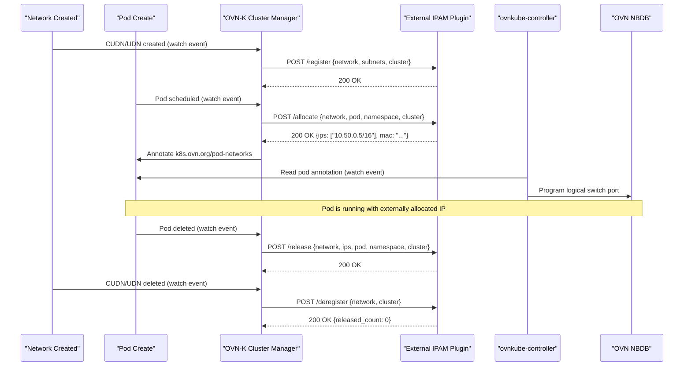
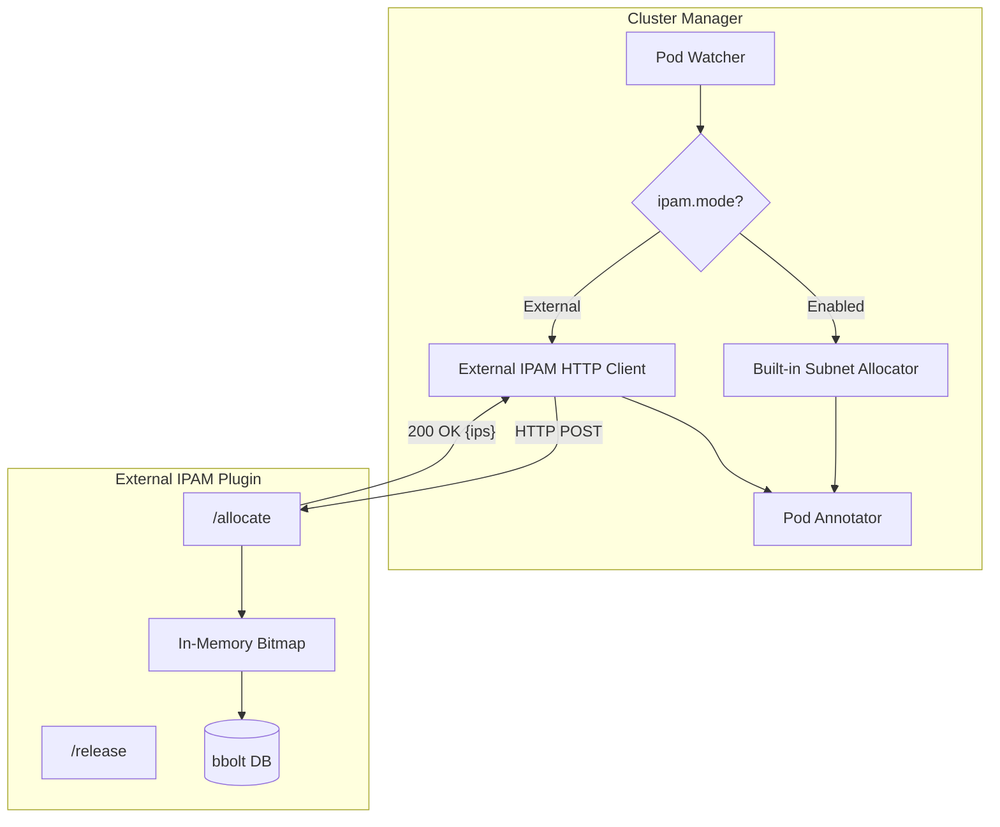
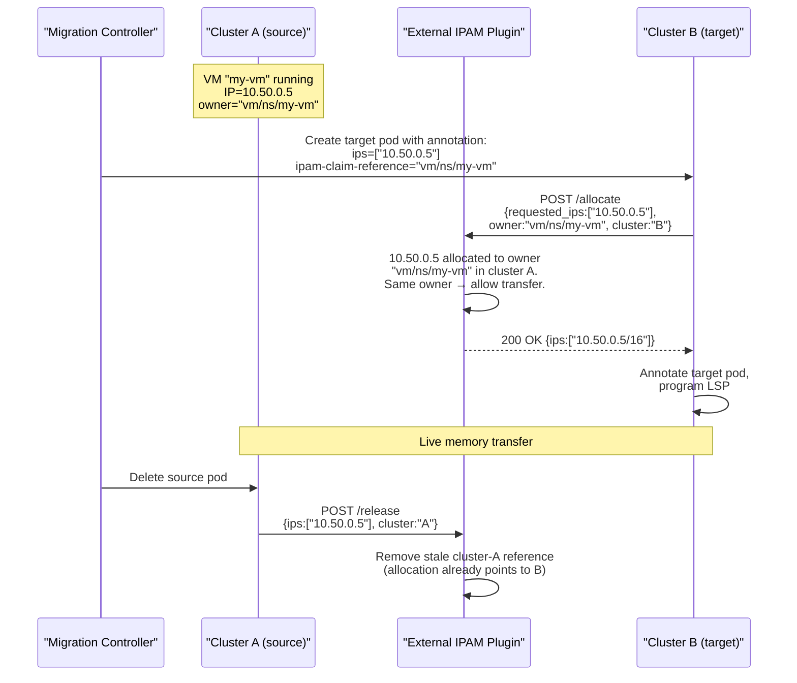

# OKEP-6831: External IPAM Plugin Support

* Issue: [#6831](https://github.com/ovn-kubernetes/ovn-kubernetes/issues/6831)

## Problem Statement

OVN-Kubernetes supports three IPAM modes for User Defined Networks:
`Enabled` (OVN-Kubernetes allocates from subnets), `Disabled` (no IP assignment,
Secondary only), and `DHCP` (delegates to external DHCP server, Secondary
Localnet only per OKEP-6224). There is no mechanism to delegate IP
allocation to an external service for **primary Layer2 UDNs/CUDNs** — the
topology used for stretched L2 networks across clusters. Multi-cluster
deployments need a centralized IPAM service to allocate IPs from a single
flat pool across all clusters, guaranteeing uniqueness without CIDR
partitioning or address waste.

## Goals

- Introduce a new IPAM mode (`External`) for **primary** Layer2
  CUDNs/UDNs that delegates IP allocation to an external HTTP-based
  IPAM service.
- Define a stable HTTP API contract between OVN-Kubernetes and external
  IPAM plugins.
- Enable OVN-Kubernetes to call the external plugin during pod
  scheduling, receive an IP allocation, annotate the pod, and program
  the OVN logical switch port — all transparently to the workload.
- Support static IP requests via the existing OKEP-5233 pod annotation
  (`v1.multus-cni.io/default-network` with `ips` field), routed
  through the external plugin as `requested_ips`.
- Publish a reference `external-ipam-plugin` implementation under the
  `ovn-kubernetes` GitHub organization.
- Support cross-cluster live VM migration IPAM by introducing
  owner-based allocation semantics: the same logical entity (VM) can
  re-acquire its IP on a different cluster without conflict.
- Support multi-cluster deployments where a single external IPAM
  instance manages a flat IP pool across all clusters.
- Support overlapping IP address spaces across different networks:
  the plugin tracks allocations per-network, allowing the same IP
  range to be used independently by different UDNs without conflict.

## Future Goals

- Supporting `External` mode on Layer3 Primary Networks and
  Layer3/Layer2/Localnet Secondary Networks.
- Supporting `External` mode on the Cluster Default Network (CDN).
  Overlapping IPs are not possible in this case (all clusters share
  a single routable address space), so this represents a different
  use case focused purely on centralized allocation and governance.
- HA external IPAM with active-passive failover and state replication.
- IPv6-only and dual-stack external IPAM pools.
- Integration with enterprise IPAM systems (Infoblox, BlueCat) via
  adapter plugins.
- Webhook-based admission validation to reject pods requesting IPs
  outside the managed pool.

## Non-Goals

- Replacing the existing `Enabled` IPAM mode for clusters that do not
  need external orchestration.
- Implementing a full-featured enterprise IPAM system within
  OVN-Kubernetes itself.
- Implementing DHCP-based IPAM (covered by OKEP-6224, supports
  Secondary Localnet only).
- Managing IP allocation for the default cluster network (CDN); this
  feature targets User Defined Networks only.

## Introduction

Multi-cluster Kubernetes deployments increasingly require stretched L2
networks — a single broadcast domain spanning multiple clusters — for
workload mobility, disaster recovery, and simplified service discovery.
OVN-Kubernetes supports EVPN (OKEP-5088) which enables Layer 2 UDN
segments to be stretched across the external network fabric using
MAC-VRFs and VXLAN. This is critical for VM migration: a VM can
migrate from an external provider network into a Kubernetes cluster
(or between clusters) while preserving its IP and MAC address,
because both endpoints share the same L2 broadcast domain via EVPN.

OKEP-5088 explicitly lists "interconnecting two Kubernetes clusters
with EVPN and allowing VM migration across them" as a future goal.
This OKEP provides the IPAM component needed to realize that goal:
when pods or VMs across clusters share the same L2 EVPN subnet, IP
address uniqueness must be enforced globally, not per-cluster.

Without a centralized allocator, the only alternative is to
pre-partition the subnet into per-cluster blocks using
`reservedSubnets`. For example, splitting a /16 across 10 clusters
means each cluster gets a /20 (4096 IPs). This approach has serious
drawbacks:

- **Address waste**: A cluster running 50 pods still consumes a /20.
  At 100 clusters the waste is enormous.
- **Rigid planning**: The operator must predict per-cluster capacity
  upfront. Growing a cluster beyond its partition requires subnet
  re-planning and potential IP renumbering.
- **No workload mobility**: Moving a VM from cluster A to cluster B
  means it must change IP (its old IP belongs to A's partition),
  breaking existing connections and firewall rules.
- **Combinatorial complexity**: Dual-stack, multiple subnets per AND,
  and heterogeneous cluster sizes make the partition math unwieldy
  and error-prone.

A centralized external IPAM service eliminates all of these issues by
allocating from a single flat pool on demand.

Today, OVN-Kubernetes offers two relevant modes for primary Layer2 UDNs:

- `Enabled`: OVN-Kubernetes's built-in allocator manages IPs, but it operates
  per-cluster with no cross-cluster coordination.
- `Disabled`: Only supported for Secondary networks. Even if it were
  available for Primary, it provides no automation — someone must
  statically assign every IP.

The `DHCP` mode (OKEP-6224) delegates to an external DHCP server but is
restricted to Secondary Localnet networks, requires L2 reachability to
the DHCP server at CNI ADD time, and doesn't fit the Primary L2 overlay
multi cluster IPAM use case.

## User-Stories/Use-Cases

### Story 1: Multi-Cluster Flat IP Pool

As a platform operator running stretched L2 networks across multiple
clusters, I want all pods on the same primary Layer2 UDN to receive
unique IPs from a single flat pool without pre-partitioning CIDRs per
cluster, so that I can schedule workloads freely across clusters without
address conflicts or wasted IP space.

For example: with `reservedSubnets` partitioning, an operator must
manually divide a /16 into per-cluster blocks (e.g. /20 per cluster),
predict per-cluster capacity upfront, and recalculate whenever clusters
are added or workload distribution shifts. Every major CNI that
supports multi-cluster networking today imposes this same constraint —
non-overlapping CIDRs must be manually planned per cluster:

- [Cilium Cluster Mesh](https://docs.cilium.io/en/latest/network/clustermesh/setup/):
  Requires "PodCIDR ranges in all clusters must be non-conflicting
  and unique." Each cluster is manually assigned a disjoint range
  (e.g. cluster1: 10.1.0.0/16, cluster2: 10.2.0.0/16). No shared
  flat pool.
- [Calico Cluster Mesh](https://docs.tigera.io/calico-cloud/multicluster/kubeconfig):
  Supports multi-cluster via VXLAN overlay or BGP underlay, but
  requires "Pod CIDRs between clusters must not overlap." IPAM
  remains per-cluster; the operator ensures uniqueness manually.
- [Kube-OVN (OVN-IC)](https://kubeovn.github.io/docs/v1.14.x/en/advance/with-ovn-ic/):
  Interconnects clusters via OVN-IC tunnels, but requires "subnet
  CIDRs in different clusters MUST NOT be overlapped" for
  auto-routing. Overlapping subnets need manual route configuration.
- [AWS VPC CNI](https://aws.amazon.com/blogs/containers/amazon-vpc-cni-increases-pods-per-node-limits/):
  Assigns pod IPs from VPC subnets. Multi-cluster is achieved via
  VPC peering or Transit Gateway, but the operator must ensure VPC
  CIDRs don't overlap. No automated cross-cluster IPAM exists.

None of these provide a single flat IP pool with automated
cross-cluster allocation, nor do they support multi-network (multiple
isolated subnets per cluster with overlapping address spaces). They
all push the CIDR partitioning burden
onto the operator. A centralized external IPAM eliminates this
planning entirely — allocations come from a single flat pool on
demand, regardless of which cluster or node the pod lands on.

### Story 2: Enterprise IPAM Integration

As a network administrator, I want OVN-Kubernetes to delegate IP
allocation for primary UDN pods to my existing enterprise IPAM system
(via an HTTP adapter), so that Kubernetes workloads follow the same IP
governance and audit trail as my non-Kubernetes infrastructure.

### Story 3: Controlled IP Assignment for Compliance

As a security engineer, I want IP allocations for sensitive workloads on
isolated primary UDNs to be managed by a central service with audit
logging, so that I can track which pod received which IP and when,
across all clusters in the fleet.

### Story 4: Graceful IP Recycling

As a cluster operator, I want released IPs on my primary L2 UDN to be
recycled after a configurable cooldown period managed by the external
plugin, so that DNS caches and firewall rules referencing the old IP
have time to expire before the IP is reassigned.

### Story 5: Cross-Cluster Live VM Migration

As a platform operator, I want a virtual machine live-migrating from
cluster A to cluster B to retain its IP address seamlessly, so that
existing connections, DNS records, and firewall rules remain valid
without manual reconfiguration after migration completes.

## Proposed Solution

This OKEP introduces `ipam.mode: External`, which tells OVN-Kubernetes
to call an external HTTP endpoint for each pod that needs an IP on a
primary Layer2 UDN. The external service owns the allocation logic,
collision avoidance, and persistence. OVN-Kubernetes handles everything
downstream: annotating the pod, programming the OVN logical switch port,
and releasing the IP on pod deletion.

This is a generic extension point. Any external IPAM system that
implements the HTTP contract can serve as the backend — from a simple
reference allocator to enterprise systems like Infoblox or BlueCat.
Network orchestrators that create L2 EVPN subnets via CUDNs across
clusters are one consumer, but the feature is not specific to any
single orchestrator.

### Architecture Overview



**TBD (to be resolved during review):** Whether the external IPAM
call should be made by the cluster-manager (as proposed above) or by
ovnkube-node directly (similar to the DHCP OKEP-6224 flow where
ovnkube-node handles IPAM during CNI ADD). There may be advantages
to having ovnkube-node call the plugin — it avoids the pod annotation
round-trip entirely if ovnkube-controller and ovnkube-node are
eventually combined into a single process (eliminating the need for
the annotation as the coordination mechanism). For now, the
cluster-manager approach is proposed because L2 IPAM is already
centralized there, and ovnkube-controller relies on the pod
annotation to program the logical switch port — so something must
annotate regardless, keeping changes minimal with this approach.
This is open for discussion.

### External IPAM Plugin: Communication Model

The `external-ipam-plugin` is a standalone microservice published at
`github.com/ovn-kubernetes/external-ipam-plugin`. It runs as a
Kubernetes Deployment (single replica). Recovery from crashes relies
on the Deployment's restart policy — OVN-Kubernetes retries requests with
backoff during the brief restart window, so no allocations are lost.
HA with multiple replicas and leader election is a future goal
(see Future Goals).

#### API Style: RPC over HTTP

The plugin exposes an **open plugin interface** — any conforming
backend can implement it, from the reference bbolt-based allocator
to enterprise IPAM systems like Infoblox, BlueCat, or NetBox. The
`externalIPAM.url` and `caBundle` fields in the CUDN spec point
OVN-Kubernetes at whichever implementation is deployed.

The API uses **RPC-style HTTP** — all endpoints are action-oriented
POSTs with JSON request/response bodies:

- `POST /register` — register a network pool
- `POST /deregister` — remove a network pool
- `POST /allocate` — allocate an IP for a pod
- `POST /release` — release an IP for a pod
- `GET /status` — health check and pool statistics

RPC-style is chosen over REST because:

1. **Well-defined plugin contract** — the client (OVN-Kubernetes) knows the
   exact endpoints at compile time. Third-party implementors get a
   flat, explicit handler map with no REST routing conventions to
   learn.
2. **No URL encoding issues** — network names stay in the JSON body,
   avoiding path-encoding problems with dots, slashes, or other
   characters.
3. **Single validation path** — all request context is in the body,
   parsed and validated in one place.

gRPC (protobuf over HTTP/2) would offer marginally better
serialization performance, but adds protobuf schema management and
code generation overhead. Since the IPAM hot path is dominated by
the bbolt write (~0.1ms), not JSON parsing, HTTP/JSON is the
pragmatic choice. gRPC may be added as an optional transport in a
future iteration.

#### Deployment Topology

```
┌────────────────────────────────────────────────────────┐
│                Hub Cluster (or standalone)             │
│                                                        │
│   ┌──────────────────────────────────────────────┐     │
│   │  external-ipam-plugin (Deployment)           │     │
│   │  - HTTP server :9500                         │     │
│   │  - bbolt on hostPath /var/lib/external-ipam/ │     │
│   │  - single replica, restart on failure        │     │
│   └──────────────────────────────────────────────┘     │
└────────────────────────────────────────────────────────┘
        ▲              ▲              ▲
        │ POST /       │ POST /       │ POST /
        │ register,    │ allocate,    │ release
        │ allocate,    │ release      │
        │ release      │              │
┌───────┴───┐  ┌───────┴───┐  ┌──────┴────┐
│ Cluster A │  │ Cluster B │  │ Cluster C │
│ ovnkube   │  │ ovnkube   │  │ ovnkube   │
│ cluster-  │  │ cluster-  │  │ cluster-  │
│ manager   │  │ manager   │  │ manager   │
└───────────┘  └───────────┘  └───────────┘
```

Each spoke cluster's ovnkube-cluster-manager connects to the plugin
via the URL configured in `externalIPAM.url` on the CUDN. For
single-cluster deployments, the plugin runs in the same cluster and
is reached via a Kubernetes Service
(`http://external-ipam.ipam-system.svc.cluster.local:9500`). For
multi-cluster, the plugin is reachable externally via TLS with
mTLS or token-based authentication.

### API Details

#### New IPAM Mode

Extend the `IPAMMode` enum:

```go
// +kubebuilder:validation:Enum=Enabled;Disabled;DHCP;External
type IPAMMode string

const (
    IPAMEnabled  IPAMMode = "Enabled"
    IPAMDisabled IPAMMode = "Disabled"
    IPAMDHCP     IPAMMode = "DHCP"
    IPAMExternal IPAMMode = "External"
)
```

#### New ExternalIPAM Configuration

Add an `ExternalIPAM` struct to the IPAM configuration:

```go
type IPAMConfig struct {
    // Mode controls IP allocation strategy.
    // +optional
    Mode IPAMMode `json:"mode,omitempty"`

    // Lifecycle controls IP lifecycle (Persistent for IPAMClaims).
    // +optional
    Lifecycle NetworkIPAMLifecycle `json:"lifecycle,omitempty"`

    // ExternalIPAM configures the external IPAM plugin endpoint.
    // Required when mode is "External".
    // +optional
    ExternalIPAM *ExternalIPAMConfig `json:"externalIPAM,omitempty"`
}

// ExternalIPAMConfig defines the connection parameters for an
// external IPAM service.
type ExternalIPAMConfig struct {
    // Name is a human-readable identifier for this external IPAM
    // plugin instance. Used in logs, events, and status conditions
    // to distinguish between different plugin backends.
    // Example: "prod-ipam", "infoblox-east"
    //
    // +kubebuilder:validation:Required
    // +kubebuilder:validation:MinLength=1
    // +required
    Name string `json:"name"`

    // URL is the base URL of the external IPAM plugin HTTP endpoint.
    // Must be a valid HTTP or HTTPS URL.
    // Example: "http://external-ipam.ipam-system.svc.cluster.local:9500"
    //
    // +kubebuilder:validation:Required
    // +kubebuilder:validation:Pattern=`^https?://`
    // +required
    URL string `json:"url"`

    // CABundle is a PEM-encoded CA certificate bundle for validating
    // the plugin's TLS certificate. If unset and URL is HTTPS, the
    // system trust store is used.
    // +optional
    CABundle []byte `json:"caBundle,omitempty"`

    // TimeoutSeconds is the maximum time to wait for a response from
    // the plugin. Defaults to 10 seconds.
    // +optional
    // +kubebuilder:validation:Minimum=1
    // +kubebuilder:validation:Maximum=60
    // +kubebuilder:default=10
    TimeoutSeconds int32 `json:"timeoutSeconds,omitempty"`
}
```

#### CRD Validation Rules

```yaml
# Layer2 topology validations for External mode:
- message: "External ipam.mode requires externalIPAM configuration"
  rule: >-
    !has(self.ipam) || !has(self.ipam.mode) ||
    self.ipam.mode != "External" ||
    (has(self.ipam.externalIPAM) && has(self.ipam.externalIPAM.url))

- message: "Subnets are required when ipam.mode is External"
  rule: >-
    !has(self.ipam) || !has(self.ipam.mode) ||
    self.ipam.mode != "External" || has(self.subnets)

- message: "externalIPAM must be unset when ipam.mode is not External"
  rule: >-
    !has(self.ipam) || !has(self.ipam.externalIPAM) ||
    (has(self.ipam.mode) && self.ipam.mode == "External")

- message: "External ipam.mode is only supported for Primary network"
  rule: >-
    !has(self.ipam) || !has(self.ipam.mode) ||
    self.ipam.mode != "External" || self.role == "Primary"

# Layer3Config and LocalnetConfig — reject External mode entirely:
- message: "External ipam.mode is only supported for Layer2 topology"
  rule: >-
    !has(self.ipam) || !has(self.ipam.mode) ||
    self.ipam.mode != "External"
```

Note: `External` mode is restricted to **primary Layer2 UDNs** because:

1. Primary L2 is the topology used for stretched multi-cluster subnets
   (EVPN).
2. For L2, IPAM is managed by cluster-manager (centralized), making it
   natural to delegate outward.
3. For L3, IPAM is per-node (distributed), which doesn't map to a
   centralized external service.
4. Secondary networks already have `Disabled` mode available for
   manual/external IP management.

Unlike `Disabled` mode, `External` mode **requires** the `subnets`
field so that OVN-Kubernetes knows the address space (for gateway IP
derivation, route injection, port security ranges). The external plugin
is responsible for allocating within that range, but OVN-Kubernetes needs the
subnet metadata for datapath programming.

#### Example ClusterUserDefinedNetwork

```yaml
apiVersion: k8s.ovn.org/v1
kind: ClusterUserDefinedNetwork
metadata:
  name: blue-network
spec:
  namespaceSelector:
    matchLabels:
      network.example.io/subnet: "blue"
  network:
    topology: Layer2
    layer2:
      role: Primary
      subnets:
        - "10.50.0.0/16"
      ipam:
        mode: External
        externalIPAM:
          url: "http://external-ipam.ipam-system.svc.cluster.local:9500"
          timeoutSeconds: 5
```

#### External IPAM Plugin HTTP API Contract

The external plugin MUST implement the following HTTP endpoints.

##### POST /register

Called by cluster-manager when a network with `ipam.mode: External`
is created (i.e., when `NewNetworkController` is invoked for the
network). This gives the plugin advance knowledge of the pool,
allowing it to pre-allocate bitmaps and validate the subnet.

Request:
```json
{
  "network": "blue-network",
  "subnets": ["10.50.0.0/16"],
  "cluster": "us-east-1",
  "exclude_ips": ["10.50.0.1"]
}
```

Field semantics:

- `network`: The network name (from the UDN/CUDN `.spec.network`).
- `subnets`: The CIDR ranges for the pool.
- `cluster`: Identity of the calling cluster.
- `exclude_ips` (optional): IPs that must never be allocated (e.g.,
  gateway IPs derived by OVN-Kubernetes from the subnet).

Response (200 OK):
```json
{}
```

**Idempotency**: If the network is already registered (same name and
subnets), the plugin returns 200. If the same network is registered
with different subnets, the plugin returns `409 Conflict` — subnet
changes require deregister + re-register.

**TBD**: Whether the plugin should allow subnet *additions* (e.g.,
adding a secondary CIDR to an existing network) without requiring a
full deregister + re-register cycle. Removals would never be allowed
as they could orphan existing allocations.

Error responses:

- `409 Conflict` — network already registered with different subnets
- `400 Bad Request` — invalid parameters

##### POST /deregister

Called by cluster-manager when a network with `ipam.mode: External`
is deleted (i.e., during `networkClusterController.Cleanup()`). This
tells the plugin to release the entire pool and wipe all allocations
for that network from the given cluster.

Request:
```json
{
  "network": "blue-network",
  "cluster": "us-east-1"
}
```

Response (200 OK):
```json
{
  "released_count": 42
}
```

The `released_count` field indicates how many allocations were freed.
If the network was already deregistered (or never registered), the
plugin returns 200 with `released_count: 0` (idempotent).

---

**Idempotency requirement**: The `/allocate` endpoint MUST be
idempotent on the tuple (network, pod, namespace, cluster). If the
plugin already has an allocation for the same pod, it MUST return the
previously allocated IP rather than allocating a new one. This ensures
that network outages or ovnkube crashes between receiving the allocation
and annotating the pod do not cause IP leaks — OVN-Kubernetes simply retries
the same request and gets the same answer.

##### POST /allocate

Request:
```json
{
  "network": "blue-network",
  "subnets": ["10.50.0.0/16"],
  "pod": "my-pod-abc123",
  "namespace": "tenant-a",
  "cluster": "us-east-1",
  "node": "worker-3",
  "requested_ips": ["10.50.0.5/16"],
  "owner": "vm/tenant-a/my-vm"
}
```

Field semantics:

- `network`, `subnets`, `pod`, `namespace`, `cluster`, `node`:
  Required context for the allocation.
- `requested_ips` (optional): When present, the plugin allocates
  exactly these IPs. When absent, the plugin allocates the next
  available IP(s) from the pool. This field is populated by ovnkube
  when the pod carries a static IP request via the
  `v1.multus-cni.io/default-network` annotation (OKEP-5233).
- `owner` (optional): A stable identity for the logical entity that
  owns this IP across pod lifecycles and cluster boundaries. Derived
  from the `ipam-claim-reference` field in the pod's network
  selection annotation. Used for cross-cluster live VM migration:
  when the same owner requests an already-allocated IP, the plugin
  treats it as a transfer rather than a conflict.

Plugin allocation logic:

```
if requested_ips is absent:
    → allocate next available IP from pool
    → return allocated IP

if requested_ips is present:
    if IP is free:
        → allocate it
    elif IP is allocated AND owner matches:
        → transfer: update allocation to new pod/cluster
    elif IP is allocated AND owner differs (or no owner):
        → reject: 409 Conflict
```

Response (200 OK):
```json
{
  "ips": ["10.50.0.5/16"],
  "mac": "0a:58:0a:32:00:05",
  "gateway": "10.50.0.1"
}
```

The `mac` and `gateway` fields are optional. If omitted,
OVN-Kubernetes derives the MAC from the IP (standard `IPAddrToHWAddr`)
and uses the network's configured default gateway.

Error responses:

- `503 Service Unavailable` — plugin not ready (OVN-Kubernetes retries with
  backoff)
- `409 Conflict` — IP pool exhausted
- `400 Bad Request` — invalid parameters

##### POST /release

Request:
```json
{
  "network": "blue-network",
  "ips": ["10.50.0.5/16"],
  "pod": "my-pod-abc123",
  "namespace": "tenant-a",
  "cluster": "us-east-1"
}
```

Response (200 OK):
```json
{}
```

Release MUST NOT be best-effort — IP leaks are unacceptable. If the
plugin is unreachable during pod deletion, OVN-Kubernetes queues the
release in a persistent retry queue and retries with exponential
backoff until it succeeds. On cluster-manager restart, `syncPods`
detects any pods deleted while down and re-issues `/release` calls
for their allocations.

##### GET /status

Response (200 OK):
```json
{
  "ready": true,
  "pools": {
    "blue-network": {
      "cidr": "10.50.0.0/16",
      "allocated": 1523,
      "available": 64011
    }
  }
}
```

Used for health checks and Prometheus metric scraping.

### Implementation Details

#### OVN-Kubernetes Changes (Cluster Manager)

For Layer2 UDNs, IPAM is managed by the cluster-manager component.
The following changes are required:

1. **New IPAM mode detection**: In the cluster-manager's pod allocator,
   detect `ipam.mode == External` and route to a new
   `externalIPAMAllocator` instead of the built-in subnet allocator.

2. **Network registration**: When the cluster-manager creates a new
   `networkClusterController` for an External IPAM network (via
   `NewNetworkController`), it calls `POST /register` with the
   network name, subnets, cluster identity, and excluded IPs (e.g.,
   gateway). This tells the plugin to initialize the pool. On network
   deletion (`Cleanup()`), it calls `POST /deregister` to wipe all
   allocations for that network.

3. **External IPAM client**: A new package
   `pkg/allocator/ip/external/` implements an HTTP client that calls
   the plugin's `/register`, `/deregister`, `/allocate`, and `/release`
   endpoints.
   The client:
   - Uses a shared `http.Client` with connection pooling and the
     configured timeout
   - Validates TLS using `caBundle` if provided
   - Includes `X-Request-ID` headers for tracing
   - Retries on 503 with exponential backoff (max 3 retries, 1s base)

4. **Pod annotation flow**: After receiving the allocation response,
   the cluster-manager annotates the pod with
   `k8s.ovn.org/pod-networks` exactly as it does today for `Enabled`
   mode. The downstream ovnkube-controller reads this annotation and
   programs the logical switch port — no changes needed there.

5. **Release on pod deletion**: The cluster-manager's existing pod
   deletion handler is extended to call `/release` for External IPAM
   networks. A retry queue handles transient failures.

6. **Release on restart (syncPods)**: When the cluster-manager
   restarts, its existing `syncPods` logic lists all pods and
   compares them against expected state. For External IPAM networks,
   any allocations that correspond to pods which were deleted while
   the cluster-manager was down will trigger `/release` calls to the
   plugin. This ensures transient ovnkube crashes do not leak IPs —
   the plugin's state is reconciled on every cluster-manager restart
   without any plugin-side polling.

7. **Startup (no local state rebuild needed)**: On cluster-manager
   restart, External IPAM networks do NOT require local state
   rebuild. The external plugin owns the allocation state. The
   cluster-manager simply re-reads pod annotations to populate its
   port cache (existing behavior).



#### Static IP Requests

When a pod carries a static IP request via the
`v1.multus-cni.io/default-network` annotation (OKEP-5233 flow):

```yaml
metadata:
  annotations:
    v1.multus-cni.io/default-network: |
      {
        "name": "default",
        "namespace": "ovn-kubernetes",
        "ips": ["10.50.0.5"],
        "ipam-claim-reference": "my-vm-claim"
      }
```

The cluster-manager:

1. Reads the `ips` field → populates `requested_ips` in the plugin
   request
2. Reads the `ipam-claim-reference` field → populates `owner` in the
   plugin request
3. Calls `POST /allocate` with both fields set
4. On 200 OK: annotates pod as normal
5. On 409 Conflict: emits a Kubernetes event to the pod indicating
   the IP conflict (matches existing OKEP-5233 behavior)

If `ipam-claim-reference` is absent but `ips` is present, the request
is sent with `requested_ips` but no `owner`. The plugin treats this
as a strict static allocation — it succeeds only if the IP is free.

#### Cross-Cluster Live VM Migration (CCLVM)

Cross-cluster live VM migration preserves the VM's IP address across
cluster boundaries by leveraging the owner-based allocation model.

**Prerequisites:**
- Both clusters share the same primary L2 CUDN (same network name,
  same subnet, same external IPAM plugin URL)
- The migration controller has access to create pods in the target
  cluster

**End-to-end flow:**



**Plugin state during migration (both pods alive):**

```
network: "blue-network"
allocations["10.50.0.5"] = {
  owner: "vm/ns/my-vm",
  references: [
    {pod: "vm-source", cluster: "A", status: "active"},
    {pod: "vm-target", cluster: "B", status: "active"}
  ]
}
```

All allocations are scoped by network. Two networks with
overlapping subnets (e.g., `blue-network` and `green-network` both
using `10.50.0.0/16`) maintain independent pools — the same IP can
be allocated in both without conflict.

The plugin tracks multiple references for the same owner during the
migration window. The IP is released only when ALL references for
that owner are removed.

**MAC preservation:**

For seamless migration on L2 EVPN, the MAC address must also be
preserved. No changes are needed for this — the existing mechanisms
handle it: the migration controller includes the MAC in the target
pod's network selection annotation (`mac` field in
`NetworkSelectionElement`), OVN-Kubernetes reads it and programs the
same MAC on the new logical switch port, and EVPN handles MAC
mobility (re-advertisement from the new node).

#### Configuration

No new command-line flags or config file entries are needed. All
configuration is embedded in the CUDN/UDN spec's `ipam.externalIPAM`
field. The cluster-manager reads this from the NAD at runtime.

#### Multi-Cluster Deployment

In a multi-cluster deployment with stretched L2 networks:

```
┌─────────────────────────────────────────────────────────┐
│  Hub Cluster                                            │
│  ┌─────────────────────┐  ┌──────────────────────────┐ │
│  │  Network            │  │  External IPAM Plugin    │ │
│  │  Orchestrator       │  │  - bbolt on hostPath     │ │
│  │  (creates CUDNs)    │  │  - HTTP :9500            │ │
│  └─────────────────────┘  │  - /allocate /release    │ │
│                            └──────────────────────────┘ │
└─────────────────────────────────────────────────────────┘
         │ CUDNs replicated to spoke clusters
         ▼
┌──────────────────────┐  ┌──────────────────────┐
│  Spoke Cluster A     │  │  Spoke Cluster B     │
│  ┌────────────────┐  │  │  ┌────────────────┐  │
│  │ OVN-K Cluster  │  │  │  │ OVN-K Cluster  │  │
│  │ Manager        │──┼──┼──│ Manager        │  │
│  │ calls plugin   │  │  │  │ calls plugin   │  │
│  └────────────────┘  │  │  └────────────────┘  │
└──────────────────────┘  └──────────────────────┘
         │                          │
         └──────── HTTP ────────────┘
                    │
                    ▼
         External IPAM Plugin (hub)
```

Each spoke cluster's cluster-manager calls the central plugin. The
plugin URL in the CUDN spec points to the hub's service (exposed via
LoadBalancer, NodePort, or cross-cluster service mesh). The `cluster`
field in the allocation request identifies which cluster is requesting
the IP for deduplication and audit.

**Multi-cluster assumptions:**

This design relies on two "sameness" assumptions consistent with the
[Kubernetes MCS API](https://github.com/kubernetes/enhancements/tree/master/keps/sig-multicluster/1645-multi-cluster-services-api)
model:

1. **Namespace sameness**: A namespace with a given name is considered
   the same logical namespace across all clusters. For example,
   `tenant-a` in cluster A and `tenant-a` in cluster B represent the
   same tenant. This is required for owner-based IP transfer during
   cross-cluster VM migration — the owner identity
   `vm/tenant-a/my-vm` must resolve to the same logical entity on
   both clusters.

2. **Network sameness**: A network with a given name is considered the
   same logical network across all clusters. For example,
   `blue-network` in cluster A and `blue-network` in cluster B share
   a single flat IP pool in the plugin. This is how the plugin knows
   that `/register` calls from different clusters for the same
   network name should map to the same pool. When a network
   orchestrator manages the CUDNs, consistent naming is guaranteed.
   In standalone deployments, the operator must ensure consistent
   network naming across clusters.

### Reference Implementation: external-ipam-plugin

A reference implementation will be published at
`github.com/ovn-kubernetes/external-ipam-plugin`:

#### Architecture

```
external-ipam-plugin/
├── cmd/external-ipam-plugin/    # Entrypoint
├── pkg/
│   ├── server/                  # HTTP handlers
│   ├── allocator/               # Per-network bitmap allocator
│   ├── store/                   # bbolt persistence layer
│   └── reconciler/              # Background drift detection
├── deploy/                      # Kubernetes manifests
└── Dockerfile
```

#### State Management

- **Primary**: bbolt (embedded B+ tree key-value store) on a `hostPath`
  volume (`/var/lib/external-ipam/data.db`)
- **In-memory**: Bitmap per network for O(1) allocation
- **Startup**: Open bbolt file, rebuild bitmaps from stored
  allocations. If bbolt file is missing (node failure), fall back to
  scanning pod annotations across clusters.
- **Hot path**:
  `lock → bitmap.AllocateNext() → bbolt.Put() → unlock → return`
  (~0.1ms)

#### Persistence Model

Each allocation is stored in bbolt as:

```
Bucket: "allocations/<network-name>"
Key:    "10.50.0.5"
Value:  {
  "owner": "vm/tenant-a/my-vm",
  "references": [
    {
      "pod": "my-vm-pod",
      "namespace": "tenant-a",
      "cluster": "us-east-1",
      "allocated_at": "2026-08-20T..."
    }
  ]
}
```

When no `owner` is specified (normal pod allocation), the owner field
is left empty and the allocation is keyed solely by IP. When `owner`
is present, the plugin supports multiple concurrent references for the
same IP (migration window) and only releases the IP when all
references are removed.

#### Background Reconciler

TBD — whether the plugin needs a background reconciler to handle
permanently decommissioned clusters (where OVN-Kubernetes will never
call `/release`) is deferred to a future iteration. The initial
implementation relies entirely on OVN-Kubernetes's own release
mechanics.

#### Deployment

```yaml
apiVersion: apps/v1
kind: Deployment
metadata:
  name: external-ipam-plugin
  namespace: ipam-system
spec:
  replicas: 1
  selector:
    matchLabels:
      app: external-ipam-plugin
  template:
    spec:
      containers:
      - name: ipam
        image: ghcr.io/ovn-kubernetes/external-ipam-plugin:latest
        ports:
        - containerPort: 9500
        volumeMounts:
        - name: data
          mountPath: /var/lib/external-ipam
        args:
        - --listen=:9500
        - --data-dir=/var/lib/external-ipam
        livenessProbe:
          httpGet:
            path: /status
            port: 9500
        readinessProbe:
          httpGet:
            path: /status
            port: 9500
      volumes:
      - name: data
        hostPath:
          path: /var/lib/external-ipam
          type: DirectoryOrCreate
      nodeSelector:
        node-role.kubernetes.io/control-plane: ""
```

### Testing Details

#### Unit Testing

- `pkg/allocator/ip/external/`: Mock HTTP server, test
  allocation/release/retry/timeout paths
- `pkg/clustermanager/`: Test pod allocator routing for `External` mode
- CEL validation rules for the new `externalIPAM` field

#### E2E Testing

- Deploy external-ipam-plugin on a Kind cluster
- Create a CUDN with `ipam.mode: External`
- Verify pods receive IPs from the plugin
- Verify pod deletion triggers IP release
- Verify plugin restart recovers state from bbolt
- Verify plugin unavailability causes pod to retry (not fail
  permanently)

#### Scale Testing

- Simulate 1000 concurrent pod creates against the plugin
- Measure allocation latency p50/p95/p99
- Verify no IP collisions under concurrent load

#### Cross Feature Testing

- NetworkPolicy with External IPAM pods
- EgressIP with External IPAM pods
- Services targeting External IPAM pods
- KubeVirt VM live migration with External IPAM (IPAMClaim
  integration)
- Cross-cluster live VM migration: verify same IP is allocated on
  target cluster via owner-based transfer, source pod release does
  not free the IP until target is confirmed

### Documentation Details

- New page on ovn-kubernetes.io: "External IPAM Plugin" under User
  Defined Networks section
- API reference for the `externalIPAM` configuration
- Deployment guide for the reference plugin
- Multi-cluster setup guide

## Performance and Scale

**Allocation latency**: The external plugin adds one HTTP round-trip
to pod startup. For same-cluster deployments (plugin on hub,
cluster-manager on spoke within same datacenter), this is 1-5ms. For
cross-region, 20-80ms. This is acceptable as pod startup already takes
seconds.

**Throughput**: A single Go HTTP server handles 10,000+ req/sec. At 80
pod creates/sec across 10 clusters, the plugin is at <1% capacity.

**Memory**: Bitmap for a /16 = 8KB. Even with 1000 networks, the
plugin uses <10MB of bitmap memory. bbolt overhead is similarly
negligible.

**OVN DB impact**: Zero additional OVN DB objects. The logical switch
port programming is identical to `Enabled` mode — just the IP source
is different.

**Network edge impact**: No BUM traffic changes. The External IPAM
mode uses the same Layer2 EVPN topology as Enabled mode. Broadcast
domain size is determined by subnet size, not IPAM mode.

**Cluster-manager impact**: The HTTP call replaces the bitmap
allocation call. CPU overhead is negligible (HTTP client is pooled).
Memory overhead is reduced (no local subnet allocator bitmap needed
for External networks).

## Risks, Known Limitations and Mitigations

| Risk | Mitigation |
|------|-----------|
| Plugin unavailability blocks new pod scheduling | Retry with backoff; existing pods unaffected. Plugin uses leader election for HA. |
| Network partition between spoke and hub | Pods queue until connectivity restores. No data loss — plugin state is durable. |
| Plugin crash loses in-flight allocations | bbolt write-ahead ensures durability. Worst case: one allocation lost, reconciler detects it. |
| IP leak (plugin allocated, ovnkube crashed before annotating) | Background reconciler detects allocations with no matching pod annotation and releases them after a grace period. |
| bbolt file corruption | Fall back to full pod annotation scan. Alert operator via Prometheus metric. |

## OVN-Kubernetes Version Skew

This feature is planned for the next OVN-Kubernetes release following
acceptance. The `External` IPAM mode is additive — existing `Enabled`
and `Disabled` modes are unchanged. Clusters not using `External` mode
see no behavioral difference.

## Backwards Compatibility

- The `IPAMMode` enum gains a new value (`External`). Existing CUDNs
  with `Enabled` or `Disabled` are unaffected.
- The `IPAMConfig` struct gains a new optional field (`externalIPAM`).
  Existing resources without this field are unaffected.
- No changes to the default cluster network behavior.
- No changes to the pod annotation format (`k8s.ovn.org/pod-networks`
  remains the same structure).
- Existing E2E tests for `Enabled` and `Disabled` modes are
  unmodified. New E2E tests cover the `External` mode specifically.

## Alternatives

### Alternative 1: CNI Chain IPAM (host-local / static)

Use a standard CNI IPAM plugin (like `host-local`) chained before
OVN-Kubernetes.

**Rejected because**: CNI chain plugins allocate per-node with no
cross-node or cross-cluster coordination. They cannot provide a flat
pool across clusters. Also, OVN-Kubernetes needs the IP at the cluster-manager
level (for L2 networks) before CNI ADD runs on the node.

### Alternative 2: CIDR Partitioning Per Cluster

Split the /16 into per-cluster /20s. Each cluster's built-in IPAM
allocates from its partition.

**Rejected because**: Wastes address space. A cluster with 50 pods
still consumes a /20 (4096 IPs). Prevents workload mobility (moving a
pod to a different cluster requires IP change). Does not scale to
hundreds of clusters without tiny partitions.

### Alternative 3: DHCP-Based External IPAM (dnsmasq)

Run a DHCP server (dnsmasq) on the overlay network and have OVN-Kubernetes use
DHCP to obtain IPs.

**Rejected because**: DHCP requires L2 reachability between the node
and the DHCP server at CNI ADD time. For L2 EVPN networks stretched
across clusters, the DHCP server would need to be reachable from all
nodes across all clusters — adding complexity and a single point of
failure at the network level. The HTTP-based approach is simpler, works
cross-cluster over standard IP routing, and doesn't require OVN
datapath to be functional before IP allocation.

### Alternative 4: Network Orchestrator Directly Annotates Pods

Have the multi-cluster orchestrator watch pods and annotate them with
IPs (acting as the IPAM).

**Rejected because**: The orchestrator runs on the hub and would need
to watch all pods across all clusters. At scale (100+ clusters, 500K+
pods), this creates excessive API server load and introduces latency
(watch propagation across clusters). The external-ipam-plugin with a
pull-based HTTP API (OVN-Kubernetes calls it) avoids this fan-out problem.

### Alternative 5: CRD-Based Allocation State (IPPool CRD)

Store each allocation as an entry in a Kubernetes CRD on the hub
cluster.

**Rejected because**: etcd has a 1.5MB per-object limit. A /16 with
65K allocations exceeds this. Sharding across CRDs adds complexity.
Every allocation requires an API server write (10-15ms latency on hot
path vs 0.1ms for bbolt). Generates informer watch events for all
watchers. The embedded bbolt approach is simpler, faster, and doesn't
load the hub etcd.

## References

- [OKEP-5233: Preconfigured UDN Addresses](okep-5233-preconfigured-udn-addresses.md)
  — Static IP assignment via pod annotations for primary L2 UDNs
- [OKEP-6224: DHCP IPAM for Localnet](okep-6224-dhcp-ipam-localnet.md)
  — DHCP-based IPAM delegation (Secondary Localnet only)
- [OKEP-5088: EVPN](okep-5088-evpn.md)
  — L2 EVPN topology used by stretched multi-cluster subnets
- [bbolt](https://github.com/etcd-io/bbolt)
  — Embedded key-value store used by the reference plugin
- [Plexus](https://github.com/ovn-kubernetes/plexus)
  — Network orchestrator that creates multi-cluster L2 subnets via
  CUDNs (one consumer of this feature)
